# 消费者投诉文本分类

基于机器学习与 BERT 的**中文消费者投诉文本分类**项目。

输入一段消费者的投诉/维权描述，模型将其归入 18 个消费领域类别之一，可用于投诉工单的自动分流、领域统计与舆情归类。

---

## 一、项目背景

消费者在电商平台、共享出行、金融支付等场景中产生的投诉文本，往往是一段口语化、非结构化、领域混杂的自由文本。人工分拣这些工单成本高、时效差，且不同客服对同一投诉的归类标准并不一致。

本项目旨在构建一个**面向中文消费投诉场景的文本分类模型**，把自由文本自动映射到统一的消费领域标签体系，解决三个实际问题：

- **自动分流**：投诉进入系统后即被归类，路由到对应领域处理团队，缩短响应链路；
- **口径统一**：以固定标签体系替代人工判断，消除跨客服归类不一致；
- **数据沉淀**：结构化后的类别标签为后续的领域统计、趋势分析与舆情监测提供基础。

技术路线上，项目以传统机器学习模型作为基线，并引入 **BERT** 预训练语言模型做中文语义建模，在保证分类精度的同时兼顾推理成本。

> 本项目为团队协作项目，各成员在独立分支上分工推进（数据处理、模型训练、评估、工程化等），经评审后并入主干。

---

## 二、项目数据介绍

### 2.1 数据概览

训练数据位于 `train_augmented.csv`，为经过**规则增强**（rule-based augmentation）的中文消费者投诉文本分类数据集。

| 项目 | 说明 |
| --- | --- |
| 样本总数 | **30,000** 条 |
| 类别数 | **18** 个消费领域 |
| 原始样本 | 6,886 条（22.95%） |
| 增强样本 | 23,114 条（77.05%），增强方法均为 `rule` |
| 数据格式 | CSV，UTF-8（含 BOM） |
| 文件大小 | 约 12.25 MB |
| 文本长度 | 最短 23 字符 / 最长 271 字符 / 平均约 142 字符 |
| id 唯一性 | 30,000 个 id 全部唯一，无重复 |

### 2.2 什么是增强样本

本数据集的每条样本由**一个特征**和**一个标签**构成：

- 特征（feature）：`text`，即投诉/维权文本内容，是模型输入。
- 标签（label）：`category`，即所属消费领域，是模型要预测的目标。

除特征和标签外，样本还带有若干辅助字段，其中 `is_aug` 用来标记这条样本属于原始样本还是增强样本：

- 原始样本（`is_aug=0`）：直接从真实投诉场景采集来的文本，未做任何改写，是数据集的真身，共 6,886 条。
- 增强样本（`is_aug=1`）：由原始样本经**数据增强**（data augmentation）加工而来的文本，共 23,114 条。

**为什么要造增强样本** —— 目的就是扩充数据集。原始投诉文本存在明显的长尾分布：热门领域（如本地生活）能采到几百条，而冷门领域（如母婴食品）只有几十条。样本过少会让模型在这些类别上学不到足够的语言模式，导致分类偏袒头部类别。数据增强通过对已有文本做等价改写、扩充出语义相近但表述不同的新样本，把弱势类别的样本量补齐，从而在类别间形成更均衡的训练集。

本项目用的是**规则增强**（`aug_method=rule`），即用确定性的规则策略生成变体，例如同义词替换、句式改写、语序调整等，而不是靠模型生成。这样做的好处是可复现、可控，且不会引入模型幻觉带来的噪声。每条增强样本都通过 `variant_idx` 字段记录它对应的是原始样本的第几个变体（取值 `0`～`9`），便于溯源与去重。

需要说明的是，**增强只扩充样本数量**，不改变标签体系 —— 增强样本的 `category` 与其来源的原始样本一致。

### 2.3 字段说明

| 字段 | 角色 | 含义 |
| --- | --- | --- |
| `id` | 辅助 | 样本唯一标识 |
| `text` | **特征** | 投诉/维权文本内容（模型输入） |
| `category` | **标签** | 所属消费领域类别，共 18 类（模型预测目标） |
| `is_aug` | 辅助 | 是否为增强样本：`0` = 原始样本，`1` = 增强样本 |
| `aug_method` | 辅助 | 增强方法，当前均为 `rule`（原始样本该字段为空） |
| `variant_idx` | 辅助 | 增强变体序号（`0`～`9`），原始样本为空 |

### 2.4 类别体系与分布

18 个类别覆盖主要的消费与生活服务领域。下表中“原始”为真实采集样本数，“总数”为含增强后的样本数，“增强倍数”反映为均衡类别所做的扩充力度：

| 类别 | 原始样本 | 总样本 | 增强倍数 |
| --- | ---: | ---: | ---: |
| 本地生活 | 656 | 1,848 | ×2.8 |
| 服饰鞋包 | 397 | 1,821 | ×4.6 |
| 金融支付 | 544 | 1,816 | ×3.3 |
| 电商平台 | 560 | 1,816 | ×3.2 |
| 影音娱乐 | 486 | 1,813 | ×3.7 |
| 家居日用 | 398 | 1,809 | ×4.5 |
| 教育 | 399 | 1,798 | ×4.5 |
| 汽车 | 388 | 1,796 | ×4.6 |
| 旅游出行 | 442 | 1,784 | ×4.0 |
| 数码3C | 402 | 1,775 | ×4.4 |
| 游戏 | 400 | 1,775 | ×4.4 |
| 通讯运营商 | 402 | 1,771 | ×4.4 |
| 共享出行 | 407 | 1,768 | ×4.3 |
| 物流快递 | 410 | 1,766 | ×4.3 |
| 房产家装 | 275 | 1,749 | ×6.4 |
| 医疗健康 | 144 | 1,382 | ×9.6 |
| 婚恋交友 | 133 | 1,297 | ×9.8 |
| 母婴食品 | 43 | 416 | ×9.7 |
| **合计** | **6,886** | **30,000** | — |

### 2.5 数据处理说明

- **类别均衡化**：原始数据存在明显长尾——头部类别（本地生活等）有数百条，尾部类别（母婴食品仅 43 条）样本稀少。项目对弱势类别施加更高倍率的规则增强来扩充数据集，使增强后各类别样本量趋于均衡（多数类别约 1,700～1,850 条），缓解类别不平衡带来的模型偏置。
- **规则增强**：`aug_method=rule` 表明增强采用确定性的规则策略（如同义替换、句式改写等）生成，`variant_idx` 标记每条原始样本衍生出的变体序号，便于溯源与去重。
- **使用建议**：训练时可通过 `is_aug` 字段区分原始与增强样本，用于加权、采样或消融实验；评估时应优先在原始样本（`is_aug=0`）上报告指标，以获得对真实分布的可靠估计。

### 2.6 训练集 / 测试集划分

本数据集**自带划分缺失**（原始文件只提供 `train_augmented.csv`，没有独立的 train/test 标签），因此项目自行定义了一套**按源 id 分组**的无泄漏划分，作为全部模型评测的统一协议。

| 集合 | 来源 | 样本数 |
| --- | --- | ---: |
| 训练集 | 原始样本（80%）+ 非测试源的增强样本 | 23,852 |
| 　其中原始 | `is_aug=0` | 5,508 |
| 　其中增强 | `is_aug=1` | 18,344 |
| 测试集 | 原始样本（20%），**全部为原始样本** | 1,378 |

划分规则：

- **分组依据**：以 `id` 去掉 `#变体号` 后的**源 id** 为分组键，同一条原始投诉及其全部改写变体不可跨集。
- **切分方式**：对 6,886 条原始样本按源 id 做分层分组切分（`GroupShuffleSplit`，`test_size=0.2`，`random_state=42`），得到测试集 1,378 条原始样本（对应 1,378 个源 id）。
- **训练集装配**：其余 5,508 条原始样本，加上**源 id 不在测试集**的全部增强样本（18,344 条），合计 23,852 条。
- **测试集只用原始样本**：不含任何增强变体，以获得对真实分布的可靠估计。
- **无泄漏校验**：训练集源 id 与测试集源 id 的交集为 0。

> 说明：之所以不用普通随机划分，是因为 77% 的样本是增强变体且保留源 id，随机划分会让同一句话的变体落到测试集，造成严重虚高。详见 5.2 节。

---

## 三、数据特征与标签的处理

本节完整说明从原始数据到建模输入的每一步处理，覆盖特征（`text`）与标签（`category`）两条线。

### 3.1 数据样例

```
id       : 17401683207
category : 共享出行
text     : 街电乱扣充电宝费，多次找客服都被拒还态度差 充电宝我就用了半个小时归还，
           结果给我扣了66元，联系商家客服多次被拒绝 态度不好 不处理问题
is_aug   : 0
```

### 3.2 特征处理：字符级清洗

原始投诉文本存在大量噪声，直接送入模型会干扰学习。项目编写了字符级清洗脚本 [`resources/preprocess.py`](resources/preprocess.py)，处理项如下：

| 处理项 | 处理方式 | 说明 |
| --- | --- | --- |
| 方向控制符 | 剔除并还原字序 | `U+202E` 等 RLO/PDF 控制符会打乱字序，需反转区间内容 |
| 半角标点 | 白名单式转全角 | `, : ; ! ? ( ) "` → 全角；**刻意保留** `- / '`（型号/单位/拼音语义） |
| 省略号 | `...` / `…{2,}` 统一为单个 `…` | — |
| 重复标点 | `！！！` → `！` 等压缩 | — |
| 重复语气词 | 白名单内压缩 | 仅压 `啊/呀/啦` 等真语气词；品牌名（如拼多多）与拟声词原样保留 |
| 包装括号 | `【】〖〗[]{}` 去括号留内容 | — |
| 异体符号 | 归一 | `﹣/–/—`→`-`、`￥`→`¥`、`∶`→`:`、`•/◦`→`·` 等 |
| 撇号类 | 剔除 | `′ ″ 〞 ＇ '`（误敲撇号，转引号反而制造孤立引号） |
| 罗马数字 | `ⅠⅡ` → `1 2` | — |
| 全角拉丁字母 | `Ｍｚ` → `Mz` | — |
| 其它语言文字符 | 剔除 | 希腊/西里尔/片假名等（均为颜文字或 OCR 噪声） |
| 上标数字 | `²` → `2` 等 | 统一为普通数字形式 |
| emoji / 颜文字 | 剔除 | 含 `U+FFFC` 图片占位符；键帽 `1️⃣` 只删修饰符保留数字 |

**刻意保留的符号**：`- / . % + * @ _ | ~ \ & = > ÷ √ ≠ ℃ ° · ● ¥` —— 分别承载型号、日期、单位、链接、算式、脱敏等语义。其中 `*` 是**隐私打码**（手机号/订单号），属特征而非噪声。

清洗采用**流水线顺序**（半角转全角必须早于标点压缩），全量 30,000 条中约 56.4% 发生改变。产物为 `clean.csv`（`text, category` 两列）。完整报告见 [`resources/PREPROCESS.md`](resources/PREPROCESS.md)。

### 3.3 特征处理：强标识符省流（可选）

对手机号、社会信用代码、订单号等**无判别力的强标识符**做占位符化（→ `<手机号>` / `<信用代码>` / `<订单号>` / `<ID>`），脚本 [`resources/normalize_ids.py`](resources/normalize_ids.py)。经 A/B 实测，省流对本数据集**既不涨准确率也不提速**（上游已部分脱敏，裸手机号/信用代码为 0 条），故保留为可选方案，见 [`eda/ab_test.py`](eda/ab_test.py)。

### 3.4 标签处理：类名到整数

标签为 `category`（18 个中文消费领域）。建模需转整数标签，项目按**字典序**固定映射（可复现），脚本 [`resources/build_labels.py`](resources/build_labels.py)，同时导出两种格式：

- [`resources/class.txt`](resources/class.txt)：一行一个类名，**行号即 label id**（参考 `TMFCode/01-data/class.txt` 格式）
- [`resources/label_map.csv`](resources/label_map.csv)：`id, name, count` 三列

| id | 类名 | 样本量 | | id | 类名 | 样本量 |
| ---: | --- | ---: | --- | ---: | --- | ---: |
| 0 | 共享出行 | 1768 | | 9 | 服饰鞋包 | 1821 |
| 1 | 医疗健康 | 1382 | | 10 | 本地生活 | 1848 |
| 2 | 婚恋交友 | 1297 | | 11 | 母婴食品 | 416 |
| 3 | 家居日用 | 1809 | | 12 | 汽车 | 1796 |
| 4 | 影音娱乐 | 1813 | | 13 | 游戏 | 1775 |
| 5 | 房产家装 | 1749 | | 14 | 物流快递 | 1766 |
| 6 | 教育 | 1798 | | 15 | 电商平台 | 1816 |
| 7 | 数码3C | 1775 | | 16 | 通讯运营商 | 1771 |
| 8 | 旅游出行 | 1784 | | 17 | 金融支付 | 1816 |

产物为 `labeled.csv`（`text, category, label` 三列）。校验：id↔类名双向一致、18 类标签唯一。

### 3.5 特征处理：文本转张量

截断长度统一取 **`max_length=200`**（实测 P95≈201，超 200 被截断的样本仅 0.05%，几乎无损）。项目构建了两条张量化路线：

- 方案 A 为 **BERT tokenizer**（`D:\models\bert-base-chinese`，词表 21128）——脚本 [`resources/to_tensor_bert.py`](resources/to_tensor_bert.py)，产出 `input_ids / attention_mask / token_type_ids [30000,200]`。
- 方案 B 为 **jieba 分词 + 词频自训词表** —— 脚本 [`resources/to_tensor_tfidf.py`](resources/to_tensor_tfidf.py)，jieba 分词 → 词频统计 → 词表 28897 → 整数序列，另产出 TF-IDF 稀疏矩阵。

完整说明见 [`resources/TENSOR.md`](resources/TENSOR.md)。

---

## 四、探索性数据分析

在建模之前，对数据集做了一轮探索性分析（EDA），回答三个问题：各类别样本有多少、句子有多长、一句话里通常有几句。完整分析与结论见 [`eda/EDA.md`](eda/EDA.md)，分析脚本为 [`eda/eda.py`](eda/eda.py)。

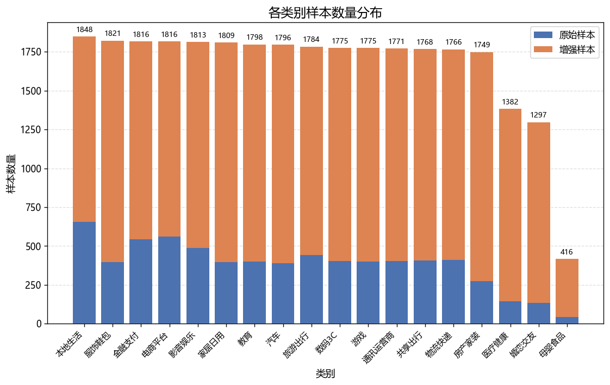

几条关键结论：

- **类别已基本均衡但尾部偏少**：增强后多数类别样本量在 1,700～1,850 之间，但医疗健康（1,382）、婚恋交友（1,297）、母婴食品（416）仍明显偏少。
- **文本长度集中在 150～200 字符**：全样本平均 142 字符，中位 165 字符，分布左偏；短的投诉往往一两句就把问题说完。
- **文本结构简单**：近六成样本仅 1～2 句，语义多在单句内完成。
- **增强引入轻微偏移**：增强样本比原始样本平均长 9～11 字符，做消融实验时需留意，评估应优先基于原始样本。
- **内容主线是交易与售后**：全样本高频词集中在购买、订单、售后、退款、拒绝等，反映投诉多发生在售后环节；各类别用词区分度高，品牌名是强类别信号。

**降维可视化 · 18 个类在向量空间里分得开吗**

上面几条看的是数量、长度与词频，再换一个视角：把文本表示成 TF-IDF 向量、经 TruncatedSVD 降到 100 维、再用 t-SNE 投到二维，直接看类别的分布。脚本 [`eda/dim_reduction.py`](eda/dim_reduction.py)，完整口径与统计量见 [`eda/dim_reduction.json`](eda/dim_reduction.json)。

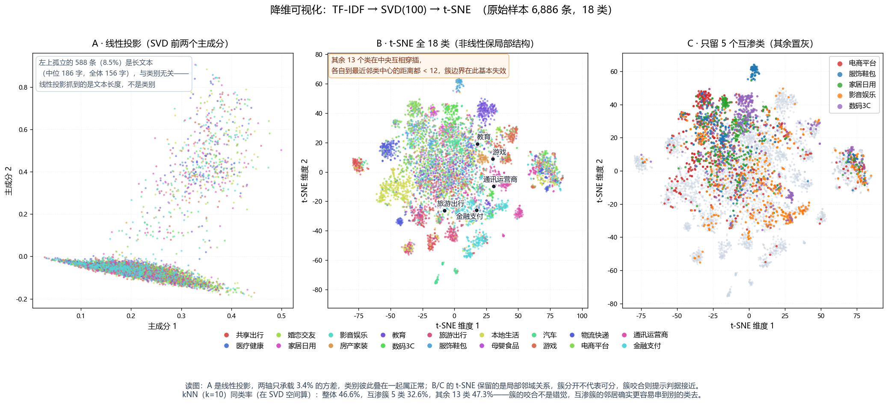

- **线性投影看不出类别**：SVD 前两个主成分只承载 3.4% 的方差，抓到的其实是文本长度（左上那 588 条孤立点的中位长度 186 字，全体仅 156 字，且类别构成分散），不是类别——想看清结构必须用非线性方法。
- **t-SNE 下只有 5 个类独立成簇**：教育、旅游出行、游戏、通讯运营商、金融支付。判据是类中心到最近邻类中心的距离不小于 12。
- **其余 13 个类挤在中央互相咬合**：家居日用、服饰鞋包、数码3C、房产家装、医疗健康、婚恋交友、母婴食品、汽车、影音娱乐、共享出行、本地生活、物流快递、电商平台——每一个到最近邻类中心的距离都小于 12，簇的边界在这一团里基本失效。
- **无监督邻域指标与后面的模型误判同向**：在 SVD 空间取每条样本的 10 个最近邻，整体同类率只有 46.6%，母婴食品 3.3%（仅 43 条原始样本，极不稳）、影音娱乐 23.9%、电商平台 25.6% 垫底。这份名单与 5.10 节的难类榜单方向一致，说明难度更像数据本身的性质。

> 只用原始样本（6,886 条）：增强样本与源样本几乎是同一句话的变体，混在一起会把同一源样本的多个变体叠成一个点，掩盖真实的类间结构。

---

## 五、建模与评估

在字符级清洗、标签编码与文本张量化完成后，项目对多条建模路线做了**无泄漏**的横向对比（脚本见 [`resources/compare_no_leak.py`](resources/compare_no_leak.py)、[`resources/compare_tfidf_clf.py`](resources/compare_tfidf_clf.py) 与 [`resources/compare_tfidf_gbdt.py`](resources/compare_tfidf_gbdt.py)，完整结论见 [`resources/TENSOR.md`](resources/TENSOR.md)）。

### 5.1 基线确立

项目最初的基线是 **TF-IDF + LinearSVC**：先用 jieba 分词构建词频词表、转成 TF-IDF 稀疏特征，再以 LinearSVC 作分类头。它训练快、实现简单、无需 GPU，作为起步基线非常合适。

在此基础上，项目再逐步引入两条更重的路线做对照：**BERT 微调**（端到端语义建模）与**词频随机嵌入**（无监督嵌入），随后又在同一份 TF-IDF 特征上换用多种分类器（朴素贝叶斯、逻辑回归、随机森林、梯度提升树等），最终确认 **LinearSVC 仍是精度与速度的最佳平衡点**，坐稳基线兼部署首选。

### 5.2 一个必须说明的评估坑：增强泄漏

本数据集 77% 是规则增强样本，且**每条增强样本的 `id` 保留了其源样本 id**（形如 `源id#变体号`）。这意味着：如果对全量数据做**普通随机划分**，同一条原始投诉及其改写变体会被切到 train / test 两侧，测试集里大量样本在训练集里有"近亲"。

项目在早期对比中确实踩过这个坑——一种词袋模型在随机划分下拿到约 0.99 的分数，但这只是"认出了同一句话的变体"、**并非真实泛化能力**。后经按源 id 分组核查确认存在系统性泄漏，故**弃用随机划分**。此处仅作记录与警示，不列出该虚高数值。

因此，下文所有指标均采用**按源 id 分组**的划分：同一条原始投诉及其全部变体只出现在训练集或测试集一侧。

### 5.3 评估协议

全部方法统一采用 2.6 节定义的**按源 id 分组**无泄漏划分：

- **测试集**：原始样本中按源 id 切出的 20%，共 1,378 条（全为原始样本）。
- **训练集**：其余 80% 原始样本（5,508 条）+ 全部非测试源的增强样本（18,344 条），共 23,852 条。
- **测试只用原始样本**（`is_aug=0`），以获得对真实分布的可靠估计。
- 训练集源 id 与测试集源 id 交集为 0，保证无泄漏。

### 5.4 三条张量路线的对比

同一无泄漏协议下，三条张量策略的表现（BERT 在 Kaggle 云端 GPU，其余本机 CPU）：

| 策略 | macro-F1 | 准确率 | 训练耗时 | 说明 |
| --- | ---: | ---: | ---: | --- |
| BERT 微调 | **0.8371** | 0.8396 | 885s（GPU） | bert-base-chinese，2 epoch |
| TF-IDF + LinearSVC | 0.8221 | 0.8229 | 13.2s（CPU） | 基线方案，词表 25251 |
| 词频随机嵌入 | 0.4742 | 0.5131 | 31.7s（CPU） | 无监督随机嵌入，明显最差 |

> 说明：上表 BERT 行为**早期 2 epoch 的初步微调**。后续按 5.8 节的抽样协议把 BERT 继续训练后，前 100 轮最优已达 macro-F1 0.8660，成为全榜第一；早期"与线性模型差距有限"的结论源于把 BERT 当冻结特征提取器（见 5.8）。

### 5.5 多种方法横向对比：30 个方法（含 BERT 微调、5 个模型压缩变体、6 个 OpenRouter 免费模型与 2 个专家组集成）

固定**同一份 TF-IDF 特征**（jieba 分词 + 词频，`min_df=2`，25,251 维）+ 同一无泄漏划分，横向对比 28 个单模型方法（其中 5 个是打榜 BERT 的压缩变体）；fastText 用同一训练/测试集自行分词训练，11 个"大模型 API"方法则直接对测试文本调用各家接口。训练集 23,852 条、测试集 1,378 条（全原始）。表中另含 1 个 **BERT 微调**（Kaggle 云端 GPU，抽样协议与曲线见 5.8）、5 个**压缩变体**（INT8 / NF4 量化、非结构化剪枝、LSTM 软标签蒸馏，见 5.12），表末 2 行则是用 5.7 节"专家组"思路把 6 个非树传统模型投票/平均概率组合后的结果。

其中大模型 API 分三类调用方式：**Jev** 走 TypeSafe 的结构化 Choice 原语（逐条判定）；**商汤 SenseNova 与云知声 U2-FLASH** 走 OpenAI 兼容接口，采用**批量分类**——一次请求打包 64 条文本，让模型返回 JSON（序号→类别名），把请求数从 1,378 次降到约 22 次；**OpenRouter 免费池** 也走批量分类，但因免费额度按"请求条数"计（0 credits 档每日仅 50 次），批次放大到 128 条、每个模型只发 11 次请求，且统一加 `reasoning.enabled=false` 关闭思考链（否则 nex / nemotron 这类思考模型会把 token 全烧在推理上、正文为空）。

> OpenRouter 免费池按请求数限额：本账号为 free tier（累计充值 0 credits），每日上限 50 次请求，表现为 429 `free-models-per-day`。按 128 条/批计算，每个模型耗 11 次请求，一天最多跑 4 个模型；本条限制是该接口的硬约束，与模型本身无关。另有一类 429 来自上游共享池（`qwen3.8-27b`、`glm-5.2`、`gemma-4` 系列返回 temporarily rate-limited upstream），与本人额度无关，免费档当日无法放行，只能择日重试。

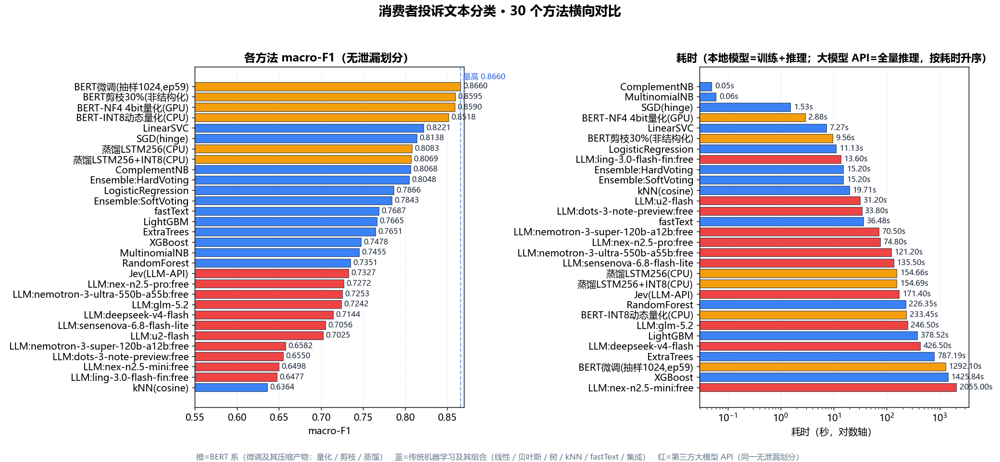

下表按 **macro-F1 降序**排列，压缩变体与专家组集成都不另开小表，一律按同一口径参与排序（图与表同序）。

| 方法 | macro-F1 | 准确率 | 耗时 |
| --- | ---: | ---: | ---: |
| **BERT 微调**（抽样 1024/epoch，ep59） | **0.8660** | **0.8628** | 1292.1s（训练 59 轮，GPU） |
| BERT 剪枝 30%（非结构化） | 0.8595 | 0.8541 | ≈0s（免训练）+9.6s（推理，GPU） |
| BERT-NF4 4bit 量化 | 0.8590 | 0.8570 | ≈0s（免训练）+2.9s（推理，GPU） |
| BERT-INT8 动态量化 | 0.8518 | 0.8483 | ≈0s（免训练）+233.5s（推理，CPU） |
| LinearSVC | 0.8221 | 0.8229 | 7.3s（训练） |
| SGD（hinge） | 0.8138 | 0.8157 | 1.5s（训练） |
| 蒸馏 LSTM 学生 256 维（20 轮） | 0.8083 | 0.8077 | 151.7s（蒸馏训练，GPU）+3.0s（推理，CPU） |
| 蒸馏 LSTM 学生 256 维+INT8 | 0.8069 | 0.8062 | 151.7s + 3.0s（推理，CPU） |
| ComplementNB | 0.8068 | 0.8128 | 0.1s（训练） |
| Ensemble:HardVoting（6 专家硬投票） | 0.8048 | 0.8099 | 15.2s（训练 6 专家）+≈0s（投票） |
| LogisticRegression | 0.7866 | 0.8012 | 11.1s（训练） |
| Ensemble:SoftVoting（6 专家平均概率） | 0.7843 | 0.7954 | 15.2s（训练 6 专家）+≈0s（投票） |
| fastText | 0.7687 | 0.7779 | 36.5s（训练） |
| LightGBM | 0.7665 | 0.7845 | 378.5s（训练） |
| ExtraTrees | 0.7651 | 0.7729 | 787.2s（训练） |
| XGBoost | 0.7478 | 0.7649 | 1425.8s（训练） |
| MultinomialNB | 0.7455 | 0.7779 | 0.1s（训练） |
| RandomForest | 0.7351 | 0.7518 | 226.4s（训练） |
| Jev（TypeSafe API） | 0.7327 | 0.7351 | 85.7s（1378 条推理） |
| nex-n2.5-pro（OpenRouter 免费） | 0.7272 | 0.7380 | 74.8s（批量 128） |
| nemotron-3-ultra-550b-a55b（OpenRouter 免费） | 0.7253 | 0.7316 | 121.2s（批量 128） |
| glm-5.2（商汤） | 0.7242 | 0.7380 | 246.5s（批量 64） |
| deepseek-v4-flash（商汤） | 0.7144 | 0.7364 | 426.5s（批量 64） |
| sensenova-6.8-flash-lite（商汤） | 0.7056 | 0.7199 | 135.5s（批量 64） |
| u2-flash（云知声） | 0.7025 | 0.7155 | 31.2s（批量 64） |
| nemotron-3-super-120b-a12b（OpenRouter 免费） | 0.6582 | 0.6718 | 70.5s（批量 128） |
| dots-3-note-preview（OpenRouter 免费） | 0.6550 | 0.6773 | 33.8s（批量 128） |
| nex-n2.5-mini（OpenRouter 免费） | 0.6498 | 0.6620 | 2055.0s（批量 128，与另一进程争用额度，属上界） |
| ling-3.0-flash-fin（OpenRouter 免费） | 0.6477 | 0.6778 | 13.6s（批量 128） |
| kNN（cosine） | 0.6364 | 0.6531 | 19.7s（训练+推理） |

几点观察：

- **BERT 微调登顶**：全榜唯一突破 0.82 天花板的方法。在"每轮只抽 1,024 条"的抽样协议下，前 100 轮最优（epoch 59）拿到 macro-F1 **0.8660**、准确率 **0.8628**，比最强传统模型 LinearSVC 高约 4.4 个点。代价是 GPU 与约 1,292 秒训练（59 轮），属百倍量级的开销。此前"BERT 与线性模型差距有限"的判断，源于把 BERT 当**冻结特征提取器**（只抽 `[CLS]` 向量再喂 SVM，权重从不更新）而非真正微调。
- **线性模型明显优于树模型**：TF-IDF 是 25,251 维的高度稀疏特征，线性模型恰好擅长；树模型在高维稀疏矩阵上难以有效分裂且过拟合，RandomForest 训练 226 秒反而只有 0.7351。
- **梯度提升树同样不划算**（XGBoost / LightGBM）：作为"更强的树模型"，二者精度仅 0.75～0.77，仍落后线性模型 5～7 个点；XGBoost 训练更要 1,426 秒（约 LinearSVC 的 200 倍）。LightGBM 因为直方图算法 + 叶子生长更快（377 秒），是树模型里性价比最高的，但依然不敌线性 SVM。
- **fastText 表现中游**（0.7687）：作为"词袋 + 词向量 + 线性分类"一体的高效基线，36 秒训练拿到 0.7687，优于全部树模型，但比线性 SVM 低约 5 个点。原因在于本文本的关键信号集中在少数强判别词（品牌/业务词），词袋线性模型已能充分捕捉，fastText 的 n-gram 子词与浅层嵌入未带来额外收益。
- **大模型 API 整体未占优**（0.65～0.73）：11 个 API 方法落在 0.65～0.73 区间，**均低于线性 SVM 约 9～17 个点**，最高者是 OpenRouter 免费池的 nex-n2.5-pro（0.7272），其次商汤 glm-5.2（0.7242）。可能原因：全量 18 类细粒度分类对"单次判定/单词表判分"偏难，且该类任务的关键信号是强判别词（品牌/业务词），LLM 更擅长开放语义理解而非封闭词表判分。其价值在于**无需训练数据与开箱即用**，而非精度。
- **OpenRouter 免费池 6 个模型呈两极分化**：nex-n2.5-pro（0.7272）与 nemotron-3-ultra-550b（0.7253）已追平商汤 glm-5.2，且耗时更低（74.8s / 121.2s）；而 nemotron-3-super-120b（0.6582）、dots-3-note-preview（0.6550）、补跑成功的 nex-n2.5-mini（0.6498）与 ling-3.0-flash-fin（0.6477）明显掉队，低于 GLM/云知声一档。可见"参数量大"不等于"分类更准"，免费池模型质量参差，需逐个实测；同门 nex-n2.5-pro 比 nex-n2.5-mini 高 7.7 个点，家族内的档次差异在本任务上很直接。耗时上 ling-3.0-flash-fin 仅 13.6s 为全部 API 方法最快，nex-n2.5-mini 的 2055s 则是两个评测进程争用同一免费额度的产物，属耗时上界、不代表模型本身速度。
- **批量分类让 API 方法更实用**：商汤与云知声采用 64 条/批的打包调用，u2-flash 仅 31 秒跑完全部 1,378 条（远快于逐条调用的 Jev 85.7 秒）。其中云知声 u2-flash 关闭思考（`thinking=disabled`）、商汤各模型关闭思考（`reasoning_effort=none`）后稳定返回 JSON，避免了思考模型"把 token 全耗在推理上、正文为空"的坑。
- **朴素贝叶斯是"秒级"基线**：ComplementNB 用 0.1 秒拿到 0.8068，适合作为超低成本的兜底方案。
- **专家组集成未反超单模型最优**（详见 5.7）：把 6 个非树传统模型做硬投票（0.8048）/软投票（0.7843），均**低于**单模型最优 LinearSVC（0.8221）——"三个臭皮匠"在此任务上没顶过"诸葛亮"，朴素投票只是把最强者拉向中庸。
- **压缩让 BERT 进入"可部署"区间**：NF4 4bit 把体积从 390MB 压到 108MB、GPU 推理快 3.2 倍，精度只掉 0.58 个点（0.8660→0.8590）；INT8 动态量化体积 145.6MB、精度掉 1.45 个点；LSTM 蒸馏学生 24.7MB 拿到 0.8083。压缩后的 BERT-NF4 在"耗时—精度"两轴上同时优于 LinearSVC，但两者设备不同（GPU vs CPU），跨设备对比要打折扣，详见 5.12。
- **若只看纯 CPU 且不想装框架**：LinearSVC 依然是最省心的选择——训练秒级、推理毫秒级、模型几 MB、零 GPU 依赖；需要 BERT 级精度时再上 NF4 量化或蒸馏学生。

### 5.6 打榜视角：耗时—准确率帕累托图

把上表放到"打榜"常见的坐标里：横轴是耗时（对数刻度，本地模型取训练 + 推理，大模型 API 取全量推理），纵轴是 macro-F1，原点在左下角——越靠左上越优（既快又准）。红点加红色虚线构成**帕累托最优边界**：边界上的方法不被任何其它方法支配（没有谁比它又快又准）。

> 口径提醒：耗时列混了三种设备——传统模型在 CPU、BERT 家族在 GPU（NF4 4bit 只能跑 GPU）、大模型 API 是网络往返。同设备内的比较（如 NF4 相对 fp32 的 3.2 倍）是干净的，跨设备只能看量级。

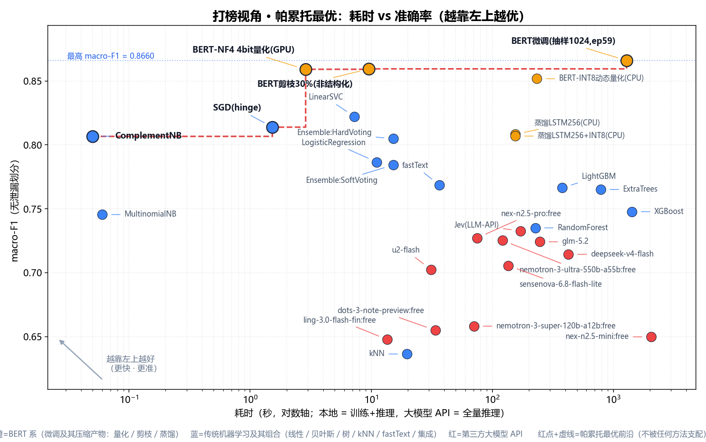

- **帕累托前沿共 5 个成员**（并入压缩变体后重新计算）：ComplementNB、SGD（hinge）、BERT-NF4 4bit 量化、BERT 剪枝 30%、BERT 微调。压缩变体把前沿整段向右下压了一档——这是 5.12 节模型压缩最直接的收益。
- **ComplementNB 是性价比之王**：0.05 秒训练即达 0.8068，速度比 LinearSVC 快约两个数量级，仅在精度上让出约 1.5 个点。
- **LinearSVC 被挤出前沿**：它用 7.3 秒换到 0.8221，而 BERT-NF4 量化只用约 2.9 秒（GPU 推理）就拿到 0.8590，两轴同时占优；传统方法里现在只剩 ComplementNB 与 SGD 凭"0.05s / 1.5s 的极低耗时"守在前沿上。
- **BERT-NF4 与 BERT 剪枝 30% 挤进前沿**：前者 2.9 秒 / 0.8590，后者 9.6 秒 / 0.8595，两者都免训练（量化与剪枝都是后处理，无梯度更新），这也是它们总耗时能压到个位数秒的原因。
- **BERT 是"精度换时间"的极端点**：1,292 秒（GPU）换 0.8660，比 LinearSVC 慢约 180 倍、准 4.4 个点。它进入前沿靠的不是快，而是"无人能及"的精度。
- **树模型与大模型 API 均在边界之内**（被支配区）：XGBoost 用 1,426 秒却只有 0.7478；11 个大模型 API 方法虽无需训练，但耗时（13.6～2055 秒）与精度（0.65～0.73）都不占优，同样位于边界之内。全部 6 个 OpenRouter 免费模型（0.6477～0.7272、13.6～2055 秒）也都落在被支配区——即便拿其中综合最好的 nex-n2.5-pro（74.8 秒 / 0.7272）去比，仍被 SVM 类（7.3 秒 / 0.8221）在两个维度同时压制。
- **两个集成组合也落在被支配区**：5.7 节的 6 专家硬/软投票（耗时 15.2s、macro-F1 0.8048 / 0.7843）同时被 ComplementNB（0.05s、0.8068）与 LinearSVC（7.3s、0.8221）支配——朴素集成既更慢又更低，未进入前沿，与"专家组没顶过诸葛亮"的结论一致。
- 一句话：这个任务上"快"与"准"各有一条路径——要性价比选 ComplementNB / LinearSVC，要绝对精度选 BERT。

这四个代表模型各自的错误结构（18 阶混淆矩阵）见 5.9 节。

### 5.7 传统老机器学习"专家组"：集成能否顶个诸葛亮

单个模型各有盲区，于是把 6 个**非树**传统模型（按用户要求剔除 RandomForest / ExtraTrees / XGBoost / LightGBM 四个树模型）当作 6 位"专家"，在同一份 TF-IDF 特征上各自独立训练，再用两种集成规则合并它们的判断：

- **硬投票**（Hard Voting）：每位专家投一个类别，多数票胜出；平票时用各专家平均概率打破。
- **软投票**（Soft Voting）：把 6 位专家的类别概率向量（LinearSVC / SGD 无 `predict_proba`，用 OvR `decision_function` 经 softmax 近似成概率）逐类求平均，取 argmax。

为量化专家组的上限，同时报告 **oracle 准确率**——只要专家组中至少一位判对即记为对，代表"若有完美仲裁者挑出最优专家"的理论天花板；以及 **专家分歧率**——至少两位专家意见不同的样本占比。

| 集成方式 | macro-F1 | 准确率 | 耗时（训练全部 6 专家） |
| --- | ---: | ---: | ---: |
| 硬投票 HardVoting | **0.8048** | 0.8099 | 15.2s（训练）+ ≈0s（投票） |
| 软投票 SoftVoting | 0.7843 | 0.7954 | 15.2s（训练）+ ≈0s（投票） |
| oracle（任一专家对，理论上限） | — | 0.9028 | — |
| 专家分歧率 | — | 0.3824（527/1378） | — |

结论性观察：

- **硬投票 / 软投票都没反超单模型最优**：硬投票 0.8048、软投票 0.7843，均低于 LinearSVC 的 0.8221（硬投票差约 1.7 个点，软投票差约 3.8 个点）。即"三个臭皮匠"在这个任务上**没顶过"诸葛亮"**——朴素投票只是把最强专家拉向中庸。
- **硬投票略优于软投票**：0.8048 vs 0.7843（差约 2 个点）。本任务里 SVM 类无原生概率（用 softmax 近似），各模型概率校准质量参差，直接平均概率被噪声拉低；而硬投票只看"谁票数多"，更稳健。
- **专家组确实拔高了弱专家**：硬投票 0.8048 高于 6 位专家 macro-F1 的均值（约 0.7685），说明投票平滑了个别失误；只是被最强者 LinearSVC 拖累，净效果为负。
- **互补空间真实存在但没被朴素投票兑现**：oracle 上限 0.9028 意味着在 1,244/1,378 条上至少有一位专家判对——若用更聪明的仲裁（stacking、按置信度加权、或只挑互补子集）而非简单多数，理论上有冲过 0.8221 的余地。
- **分歧率是集成的发力区**：专家分歧率 0.3824（527/1378 条至少两位意见不同），近四成样本专家并不一致。但本任务强判别词信号集中、线性模型已近饱和，同质专家（都吃同一份 TF-IDF）的多数票提升有限。

> 实验脚本：`resources/compare_ensemble.py`；逐专家与诊断明细见 `resources/ensemble_diag.json`。

### 5.8 BERT 微调：经典 loss / 准确率曲线

BERT（`bert-base-chinese`，12 层、约 1.1 亿参数）在 Kaggle 云端 GPU 上微调，协议刻意采用**抽样**而非"每轮喂整份训练集"：

- 每个 epoch 只从训练集**随机抽 1,024 条**（绝不整份 23,852 条），batch=32、lr=2e-5、max_len=128；
- 每轮结束记录 用时 / 训练损失 / 训练集准确率 / 测试集准确率 / 测试集 macro-F1，并**保存一次权重**；
- 停止条件：测试准确率相对历史最佳下降 ≥0.03 即判定"明显过拟合"，硬上限 200 轮。

实际在第 **105** 轮触发停止（该轮测试准确率 0.8302，比最佳低 0.0326）。前 100 轮中测试准确率最高的是 **epoch 59**（0.8628 / macro-F1 0.8660），该权重即打榜模型；若改按 macro-F1 选，最高是 epoch 86（0.8685），但那一轮的权重已被"只保留最近 3 轮"的滚动策略删除。

#### 经典之一：训练损失曲线

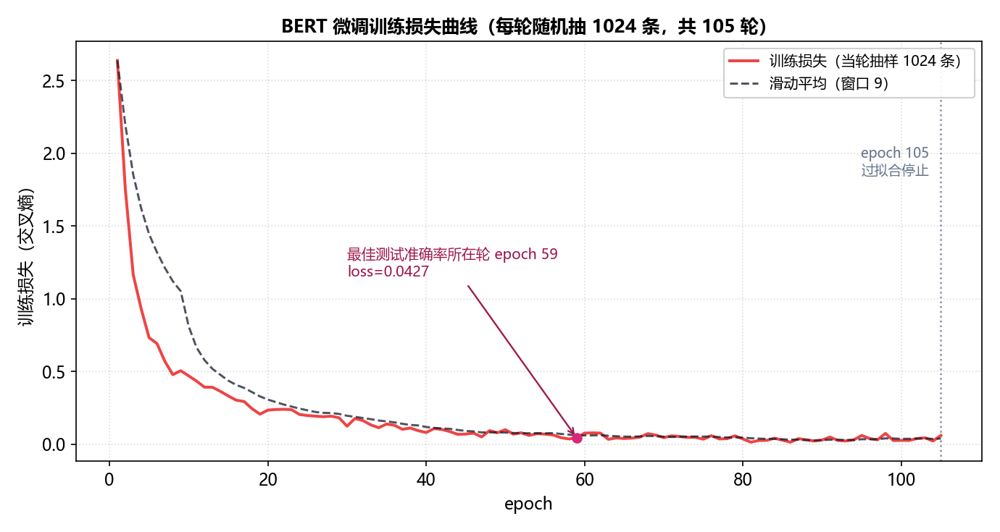

这是最经典的 BERT 微调图之一：横轴 epoch、纵轴训练交叉熵。损失从 2.64 迅速跌进 0.5 以内（前 8 轮），随后进入长尾——20 轮后已贴近 0.1，此后只是缓慢下滑并在 0.01 到 0.07 之间抖动。它说明 BERT 的预训练表征本就把任务"学到七七八八"，微调只是做最后的适配；后期损失继续下降，却几乎不再换来测试指标的提升，是典型的"损失还在降、泛化已到顶"。

#### 经典之二：训练集 vs 测试集准确率

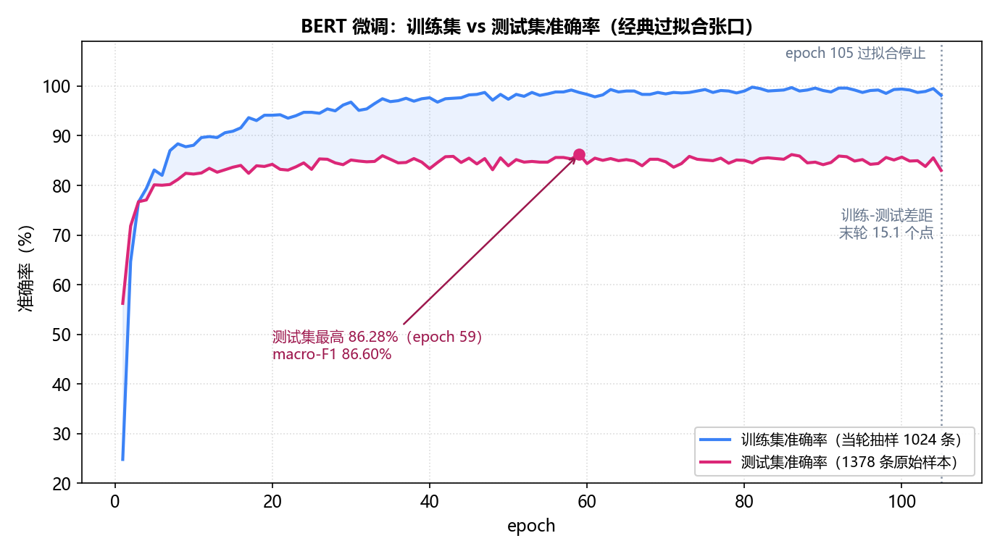

同一张图里并置两条准确率曲线，是判断过拟合最直观的"张口"图：

- **训练集准确率**（蓝）一路爬升，从 24.8% 涨到末轮 98.1%，后 40 轮基本贴着 99% 到 100%，说明模型已能"记住"当轮抽取的 1,024 条；
- **测试集准确率**（红）在约第 30 轮后进入 84% 到 86% 的平台期，此后反复震荡，不再随训练增长；
- 两条线之间的蓝色张口就是过拟合：末轮已达 15.1 个百分点（98.1% 对 83.0%）。但这个张口并未像"整份训练集"那样迅速恶化到测试崩塌，原因是每轮都换一批新的随机 1,024 条，等于用持续的随机梯度噪声做正则，把过拟合显著推后。这正是"抽样而非整份训练"的价值所在。

> 训练脚本：`resources/compare_bert_finetune.py`（首 10 轮）与 `resources/continue_bert/`、`resources/continue_bert2/`、`resources/continue_bert3/`（逐阶段续训至 105 轮）；逐轮曲线与选模依据见 7.3 节的 Release 附件 `bert_best100.json`，前 100 轮最优权重为 `bert_epoch59.pt`。

### 5.9 四个代表模型的 18 阶混淆矩阵

选取四个代表模型（ComplementNB、SGD、LinearSVC、BERT 微调）在同一测试集（1,378 条、18 类）上的混淆矩阵如下。压缩变体（BERT-NF4 / 剪枝 30%）与原模型同源、错误结构基本一致，不再单列四张图，量化后的逐样本影响见 5.12。四张图遵循同一套读图规则：

- **颜色**：白到深蓝的单调映射，格子里的数字越大颜色越深，0 为纯白；
- **统一色标**：四张矩阵的最大值取作共同上限（99）。四个模型跑的是同一份测试集，因此色深可以直接横向比较；
- **幂律着色**：用 gamma 0.45 的幂律映射代替线性映射。测试集里最小的类（母婴食品）只有 6 条样本，线性映射下这类格子的非零值会淡到看不出来，幂律在保持单调的前提下抬高了低值区的可辨识度；
- **格内数字与字色**：每格写出实际计数，字色按格子明度二选一，深格用白字、浅格用黑字。

#### ComplementNB

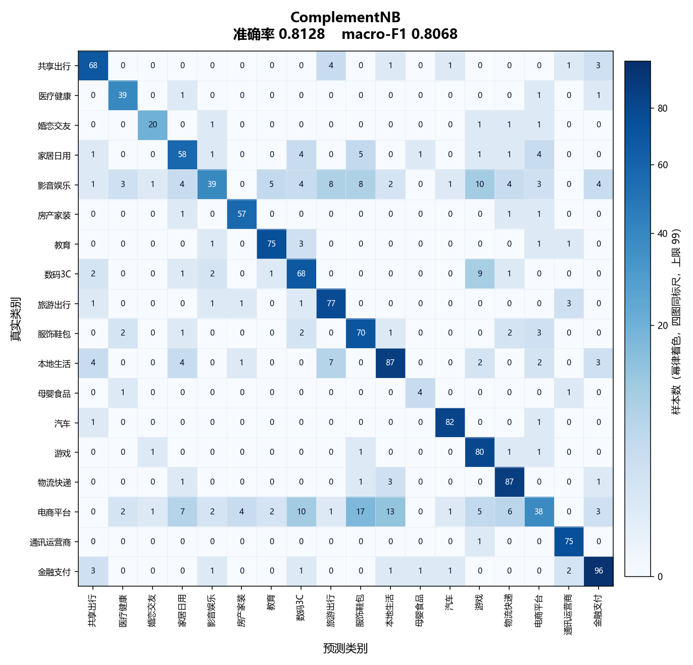

#### SGD（hinge）

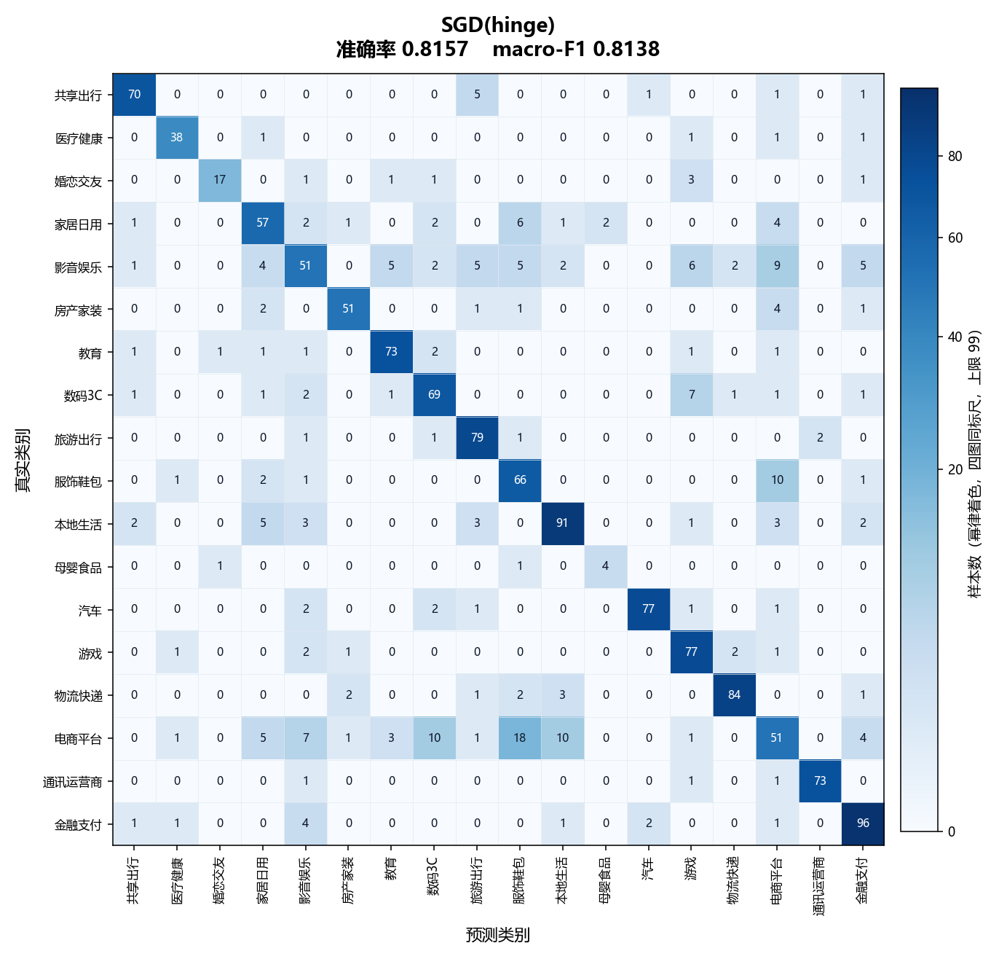

#### LinearSVC

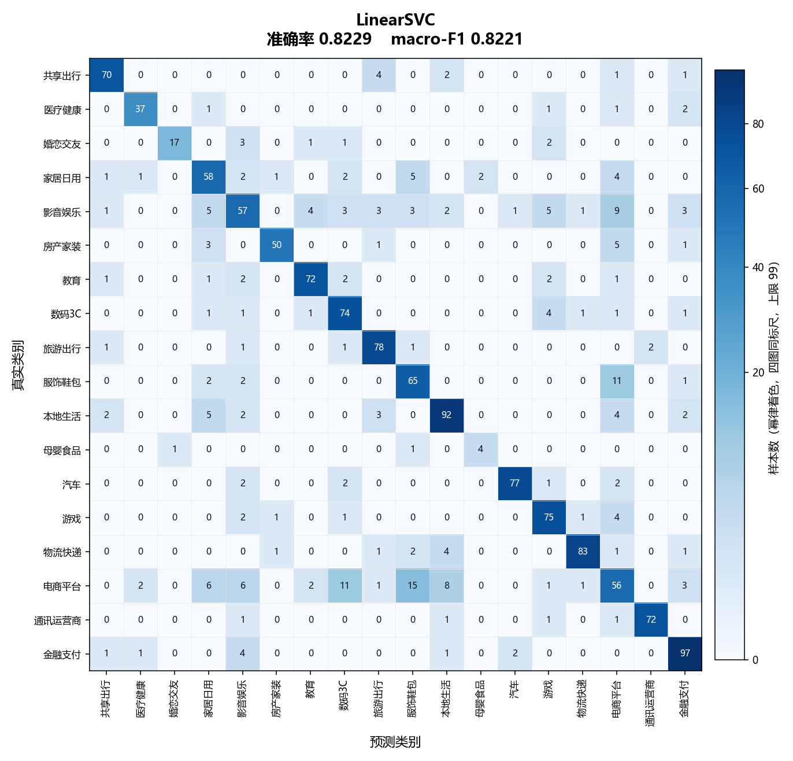

#### BERT 微调

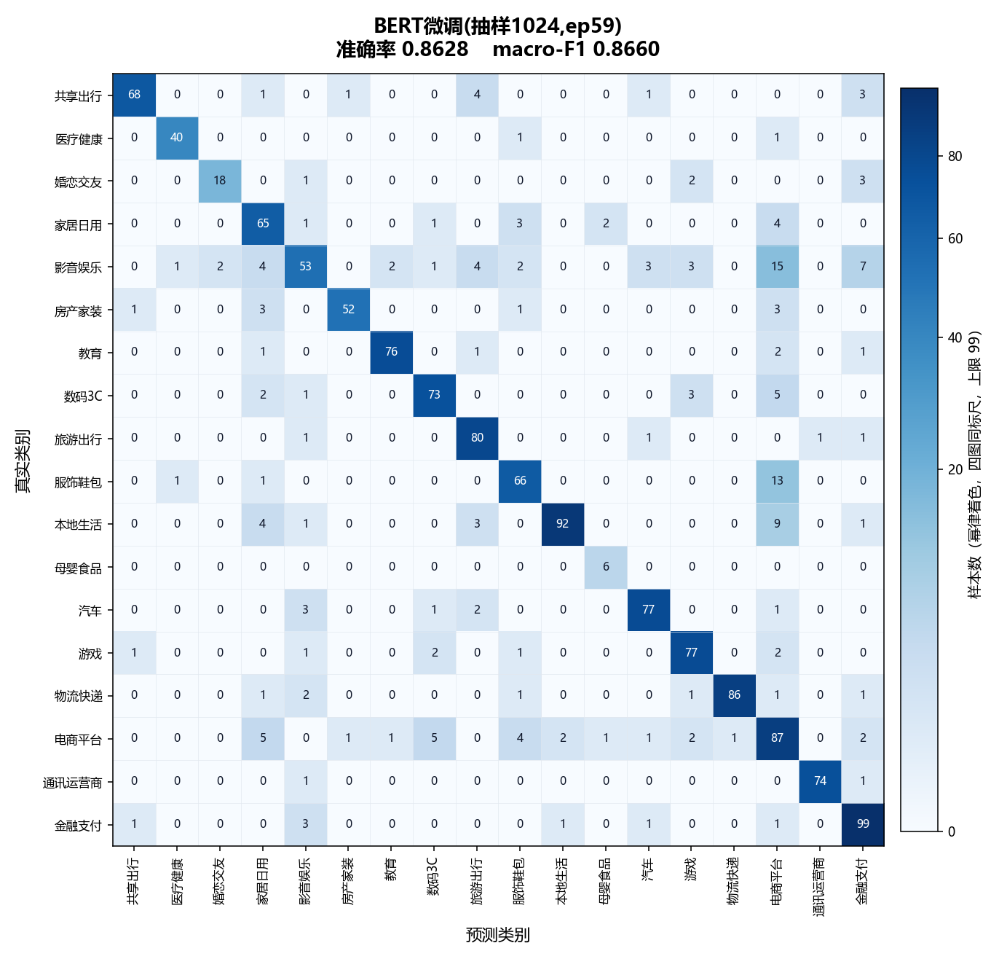

**读图要点**

- **误判高度稀疏**：324 个格子里绝大多数为空，四个模型的错误都集中在少数类别对上，深蓝只出现在对角线。
- **电商平台是最难的类别**，也是 BERT 拉开差距的主因：ComplementNB 只认出 38/112（33.9%）、SGD 51/112（45.5%）、LinearSVC 56/112（50.0%），到 BERT 才跳到 87/112（77.7%）。BERT 相对 LinearSVC 净少错 55 条，其中 31 条（56%）来自这一个类别。
- **影音娱乐是 BERT 唯一明显失手的类别**：LinearSVC 拿到 58.8% 反而最高，BERT 54.6%，ComplementNB 仅 40.2%。
- **电商平台同时是最大的"错误汇"**：LinearSVC 有 45 条其它类被误判成电商平台，BERT 更多（57 条）。它把电商平台认得更准的同时也吸走了更多模糊样本，说明电商平台、影音娱乐、服饰鞋包、数码3C 构成一个语义互相渗透的簇。
- **三个线性与贝叶斯模型的错误结构高度同源**：把各自的非对角项当向量算余弦相似度，LinearSVC 与 SGD 达 0.963、与 ComplementNB 0.805；而 BERT 与这三者只有 0.551～0.756。这说明 BERT 换掉的是判断依据本身，不只是把同一套依据调得更准。
- **逐类看 BERT 并非全胜**：18 个类别中它只在 7 个上严格最高（医疗健康、家居日用、教育、旅游出行、母婴食品、电商平台、金融支付），另外 10 个类别的召回反而不如某个传统模型（差幅多在 1～3 个点）。BERT 的总分优势集中在少数大类别上。
- **小样本类不可细读**：母婴食品测试集只有 6 条，错一条就掉 16.7 个点。三个传统模型都是 4/6，BERT 是 6/6，这个差距在统计上并不稳固。

**逐类召回率**

| 类别 | 测试 n | ComplementNB | SGD（hinge） | LinearSVC | BERT 微调 |
| --- | ---: | ---: | ---: | ---: | ---: |
| 共享出行 | 78 | 87.2% | 89.7% | 89.7% | 87.2% |
| 医疗健康 | 42 | 92.9% | 90.5% | 88.1% | 95.2% |
| 婚恋交友 | 24 | 83.3% | 70.8% | 70.8% | 75.0% |
| 家居日用 | 76 | 76.3% | 75.0% | 76.3% | 85.5% |
| 影音娱乐 | 97 | 40.2% | 52.6% | 58.8% | 54.6% |
| 房产家装 | 60 | 95.0% | 85.0% | 83.3% | 86.7% |
| 教育 | 81 | 92.6% | 90.1% | 88.9% | 93.8% |
| 数码3C | 84 | 81.0% | 82.1% | 88.1% | 86.9% |
| 旅游出行 | 84 | 91.7% | 94.0% | 92.9% | 95.2% |
| 服饰鞋包 | 81 | 86.4% | 81.5% | 80.2% | 81.5% |
| 本地生活 | 110 | 79.1% | 82.7% | 83.6% | 83.6% |
| 母婴食品 | 6 | 66.7% | 66.7% | 66.7% | 100.0% |
| 汽车 | 84 | 97.6% | 91.7% | 91.7% | 91.7% |
| 游戏 | 84 | 95.2% | 91.7% | 89.3% | 91.7% |
| 物流快递 | 93 | 93.5% | 90.3% | 89.2% | 92.5% |
| 电商平台 | 112 | 33.9% | 45.5% | 50.0% | 77.7% |
| 通讯运营商 | 76 | 98.7% | 96.1% | 94.7% | 97.4% |
| 金融支付 | 106 | 90.6% | 90.6% | 91.5% | 93.4% |

> 复现：三个传统模型由 `resources/confusion_matrices.py` 在本机复算，指标与 5.5 节的对比表逐位一致；BERT 由 Kaggle 内核 `wubarry/textcls-bert-cm` 下载 Release 权重 `bert_epoch59.pt` 后在 1,378 条测试集上推理（复现准确率 0.8628、macro-F1 0.8660，与打榜条目一致）。绘图脚本 `resources/make_confusion_fig.py`，原始计数见 `resources/confusion_matrices.json` 与 `resources/bert_confusion.json`。

### 5.10 标签质量诊断：难分的是类别，还是模型？

5.9 的混淆矩阵显示，四个模型的错误高度集中在少数类别对上。本节回答一个问题：**这些错误究竟是模型没学好还是标签定义本身在语义上互相重叠**。为了不用"某个模型的偏见"自证重叠，这里用五条相互独立的判据交叉验证。脚本与原始数据见 `resources/label_overlap_diag.py` 与 `resources/label_quality_diag.json`。

五个判据：

- **判据一 · 集体错率**：四个归纳偏置不同的模型（词级 ComplementNB / SGD（hinge） / LinearSVC + 字符级 2～4 gram LinearSVC）对同一条测试样本**至少 3 个判错**的比例。集体错意味着词面上就难分，与任何单一模型的偏好无关；由它可得这组词面模型的 oracle 上界 = 1 − 集体错率。
- **判据二 · 无模型自洽率**：测试样本最近的类中心恰好是自己类的比例（只做最近邻，不经过任何分类器）。
- **判据三 · 类中心相似度**：训练集 TF-IDF 类中心两两余弦，纯无监督，不含任何模型。
- **判据四 · 漂移去向**：自洽失败的样本被吸去了哪个类。
- **判据五 · 标注噪声排查**：原文完全相同、或前 30 字相同但标签不同的条数。

**判据一 · 集体错率排名**（全 18 类均值 16.4%，仅列前 7 名）

| 类别 | 集体错率（≥3/4 模型同错） | 词面 oracle 上界 |
| --- | ---: | ---: |
| 电商平台 | 48.2% | 51.8% |
| 影音娱乐 | 40.2% | 59.8% |
| 母婴食品（n=6，不稳） | 33.3% | 66.7% |
| 婚恋交友 | 25.0% | 75.0% |
| 家居日用 | 25.0% | 75.0% |
| 服饰鞋包 | 17.3% | 82.7% |
| 共享出行 | 10.3% | 89.7% |

**判据二 · 无模型自洽率**。自洽率 = 测试样本的最近类中心恰好是自己的类（只做最近邻、不经过任何分类器），18 类均值 68.7%，按升序排列：

| 类别 | 自洽率 | 类别 | 自洽率 | 类别 | 自洽率 |
| --- | ---: | --- | ---: | --- | ---: |
| 母婴食品（n=6） | 33.3% | 数码3C | 64.3% | 金融支付 | 77.4% |
| 影音娱乐 | 35.1% | 共享出行 | 67.9% | 教育 | 79.0% |
| 婚恋交友 | 58.3% | 汽车 | 73.8% | 物流快递 | 81.7% |
| 家居日用 | 59.2% | 本地生活 | 74.5% | 医疗健康 | 83.3% |
| 电商平台 | 59.8% | 房产家装 | 75.0% | 旅游出行 | 83.3% |
| 服饰鞋包 | 64.2% | 游戏 | 76.2% | 通讯运营商 | 90.8% |

自洽率榜与集体错率榜**大体同向但不完全一致**：影音娱乐（35.1%）在这一判据里比电商平台（59.8%）更差——它才是无模型视角下的头号难类；而婚恋交友、家居日用（均 58%～59%）在两条判据上都靠前。

**判据三 · 类中心相似对**。全部 153 个类对的平均余弦为 0.623，最高的 5 对是：服饰鞋包—电商平台 0.849、家居日用—电商平台 0.844、家居日用—服饰鞋包 0.823、影音娱乐—电商平台 0.789、家居日用—数码3C 0.788。榜首全部落在**电商平台 / 服饰鞋包 / 家居日用 / 影音娱乐 / 数码3C** 五类组成的互渗簇内。

**判据四 · 漂移去向**（自洽失败的样本被吸去了哪个类）

| 类别 | 无模型最近邻去向前 4 |
| --- | --- |
| 电商平台 | 本地生活 11、服饰鞋包 7、家居日用 5、数码3C 5 |
| 影音娱乐 | 电商平台 22、金融支付 9、旅游出行 6、家居日用 5 |
| 家居日用 | 电商平台 15、数码3C 5、服饰鞋包 3、医疗健康 2 |
| 共享出行 | 旅游出行 7、金融支付 5、物流快递 4、汽车 2 |

**判据五 · 不是脏标签**。原始数据里同一段文字挂多个类别的 **0 条**、前 30 字相同但标签不同的 **0 组**。重叠来自标注定义的边界，不是复制粘贴或错标。

**决定性证据 · 同构反向标注**。诊断中发现两条几乎同构的样本被标成了相反的类别——

> 标 电商平台："在拼多多平台购买 2 双品牌阿迪达斯的运动鞋，收到货发现鞋有脏污染色的质量问题，向店家与平台投诉"
>
> 标 服饰鞋包："拼多多买小熊拖鞋……因鞋子存在质量问题，发起退货退款。商家以鞋底脏为由拒收……我申请平台介入维权"

拼多多 + 鞋 + 质量问题 + 平台介入，两边全中。真正的判据不是"提到哪个领域"，而是**投诉对象是平台自身行为还是商品本身**（保价 / 服务费 / 仲裁 / 不作为算前者）——这是标注规范里的隐含规则，文本表层不携带。

**逐类结论**

- **电商平台 · 重叠最重**：与服饰鞋包 / 家居日用 / 数码3C / 影音娱乐构成互渗簇，判据全中。词面四模型的 oracle 上界只有 51.8%，LinearSVC 的 50.0% 已贴近上限；BERT 的 77.7% 越过该上界，说明**词面不可分而语义可分**。BERT 仍错的 25 条里，17 条连 LinearSVC 也判错（两模型视角下的真模糊，占该类 15.2%），另外 8 条 LinearSVC 反而判对，属 BERT 的个体性误判（见下方韦恩图）。
- **影音娱乐 · 并列最难且此前被低估**：无模型自洽率 35.1%，除母婴食品（n=6）外全场最低；漂移去向第一名是电商平台（22 条）；类中心对影音娱乐—电商平台 0.789、影音娱乐—金融支付 0.768（会员充值类纠纷与支付语境混叠）。BERT 在这一类只有 54.6%、反而低于 LinearSVC 的 58.8%，是 BERT 唯一明显失手处。
- **家居日用 · 互渗簇的枢纽**：集体错 25.0%、自洽率 59.2%；最相似的 5 个类对里它占了 3 个（电商平台 0.844、服饰鞋包 0.823、数码3C 0.788）。日用品天然同时出现在电商、服饰、数码、房产家装的语境里。BERT 把它提到 85.5%（比 LinearSVC 高 9.2 个点），同样是"语义可救"的部分。
- **共享出行 · 量化上不属于难类**：集体错 10.3%（18 类中排第 10，均值以下），LinearSVC 召回 89.7% 已接近词面 oracle 上界 89.7%。重叠真实存在但温和：漂移去向为旅游出行 7、金融支付 5、物流快递 4、汽车 2，边界在"网约车行程本身的投诉"与"平台的旅游 / 汽车 / 寄送业务"之间。属于**定义待细化**，不是标签缺陷。

**两张韦恩图 · 把结论画出来**

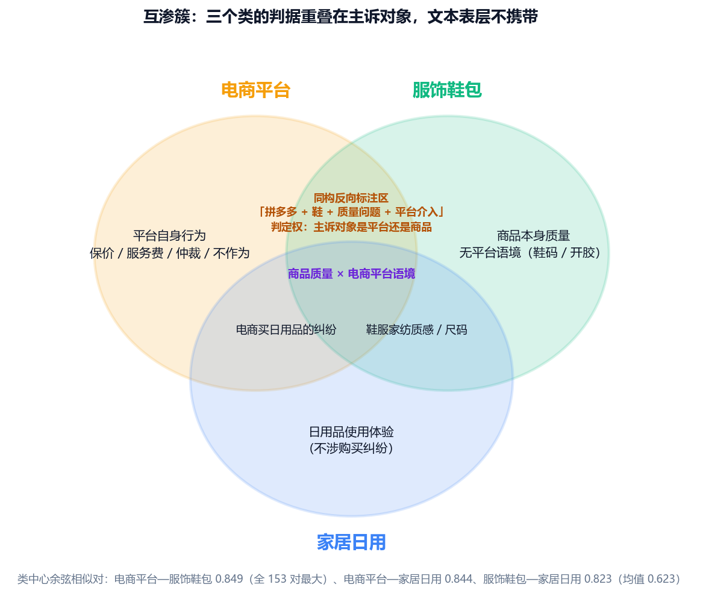

图一把互渗簇的三个核心类画成三个圆：**重叠区写同形文本而独有区写各自判据**。橙绿两圆的交叠是"同构反向标注区"——拼多多 + 鞋 + 质量问题 + 平台介入，两边全中，判定权在主诉对象；这正是它难分的原因：判据在标注规范的隐含规则里，文本表层不携带。

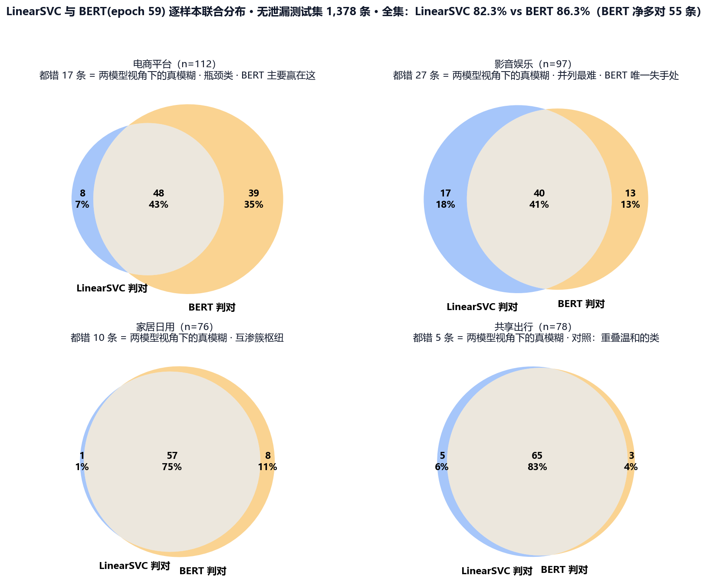

图二是逐样本联合分布（数据由 Kaggle 内核 `wubarry/textcls-bert-joint2` 在同一无泄漏测试集上算出，划分与 5.5 节一致；左圆 = LinearSVC 判对的样本集合，右圆 = BERT 判对的样本集合）：

- **电商平台**：LinearSVC 错的 64 条里 BERT 救回 39 条（61%），这是 BERT 领先的主要来源；两模型都错的只有 **17 条**（15.2%）——真模糊比"集体错率 48.2%"显示的要小得多，那个口径是四个词面模型的集体，不代表语义模型的上限。
- **影音娱乐**：都错 **27 条**（27.8%）为四类最高，实锤它并列最难；且仅 SVC 判对 17 条 > 仅 BERT 判对 13 条，两个模型各有偏好——BERT 在这里确实不占优（54.6% vs 58.8%）。
- **家居日用**：LinearSVC 错的 19 条里 BERT 救回 18 条（95%），反过来只被抢走 1 条——**接近全面占优**，是"语义可救"最干净的例证。
- **共享出行**（对照组）：都错仅 5 条（6.4%），两圆几乎重合——印证它不在难类之列，剩余错误零散而非结构性。
- **全集**：BERT 净多对 55 条（86.3% vs 82.3%），其中大部分来自电商平台（39 条）与家居日用（8 条）。

**总体结论**：准确率瓶颈主要是**标签体系的定义边界问题**——互渗簇内各类的区分判据（主诉对象）没有写进标注规范，导致同一批"商品质量问题 + 提到平台"的文本被两侧随机分配。建议：不合并类别（领域信息有真实区分度，BERT 能吃到 77.7%），改为给这五类补一条**主诉对象优先**的判定顺序，并把同构反向样本作为标注抽检集；共享出行只需在规范中补一行"行程类投诉 / 平台其他业务"的区分。模型侧（尤其 BERT）已把语义可分的部分基本吃完，继续堆模型收益有限。

### 5.11 逐类准确率归因：样本量还是标签可分性

5.9 的混淆矩阵暴露出几个难类，5.10 用五判据把原因指向标签定义边界。但在接受这个结论之前，还有一个更朴素的可能要排除：**是不是那几个类样本太少**？

把 18 个类各当成一个观测点，纵轴取同一份无泄漏测试集上四个模型（ComplementNB / SGD(hinge) / LinearSVC / BERT 微调）的平均逐类召回，分别与"类别样本数"和"无监督标签质量指标"求相关。脚本 [`resources/make_size_accuracy_fig.py`](resources/make_size_accuracy_fig.py)，全部数字见 [`resources/size_vs_accuracy.json`](resources/size_vs_accuracy.json)。

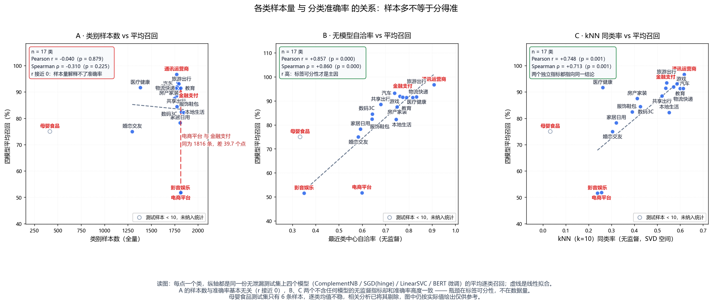

| 解释变量 | Pearson r | p | Spearman ρ | 说明 |
| --- | ---: | ---: | ---: | --- |
| 类别样本数（全量） | −0.040 | 0.879 | −0.310 | **不相关**，样本多不代表分得准 |
| 测试集类别样本数 | −0.232 | 0.370 | −0.144 | 同样不显著 |
| 无模型自洽率（5.10 判据二） | **+0.857** | 0.000 | +0.860 | 无监督，不含任何模型 |
| kNN 同类率（降维图指标） | **+0.748** | 0.001 | +0.713 | 无监督，SVD 空间 k=10 |
| 集体错率（取负） | +0.982 | 0.000 | +0.948 | 与召回同源，仅作口径自洽检查 |

相关分析剔除母婴食品（测试集只有 6 条，逐类均值不稳），表中 n = 17。

- **样本量与准确率没有关系**：Pearson r = −0.040（p = 0.879），Spearman 甚至为负（−0.310，p = 0.225），两者都不显著。样本最多的几个类里召回横跨 40 个点——本地生活 1,848 条 82.3%、服饰鞋包 1,821 条 82.4%，而同一量级的电商平台 1,816 条只有 51.8%。
- **配对证据比相关系数更直接**：电商平台与金融支付**样本数完全相同**（各 1,816 条），召回却差 **39.7 个点**（51.8% vs 91.5%）；影音娱乐（1,813 条，51.5%）与服饰鞋包（1,821 条，82.4%）只差 8 条样本，召回差 30.9 个点。同样多的数据、完全不同的结果，差异只能来自标签自身。
- **换成标签质量指标就解释得通**：两个完全不含模型的无监督指标——最近类中心自洽率（r = +0.857）与 SVD 空间 kNN 同类率（r = +0.748）——和准确率高度一致。**一个类能否被分开可以提前从数据几何看出**，不必等模型跑完。

需要说明的反面：样本量并非毫无影响。母婴食品全量只有 416 条、测试集只有 6 条，是最可能同时受"数据少"与"标签难"双重影响的类，但它样本太少、测不出稳定结论，所以既没纳入统计、也没拿它当论据。**样本量偏少的三类值得补数据**（医疗健康、婚恋交友、母婴食品），但收益不会像修复标签边界那样立竿见影。

> 口径提醒：表中"集体错率"一行与召回率同源（都是同一批模型在测试集上的表现），它对本项的高相关属同义反复，只能说明两套口径一致，不作为独立证据。

### 5.12 模型压缩：量化、蒸馏与剪枝

5.5 的榜单里 BERT 微调精度最高（macro-F1 0.8660），但 390MB 的体积与 GPU 依赖让它难以直接部署。本节对打榜模型 `bert_epoch59.pt` 做四种主流压缩，在**同一无泄漏测试集**（1,378 条、18 类）上用统一协议评估：

- **精度**：准确率与 macro-F1（下文"掉几个点"一律指 macro-F1）；
- **体积**：`state_dict` 存盘的实际字节数；
- **速度**：全测试集推理延迟，1 次预热 + 3 次计时取中位，batch=128、max_len=128（GPU 计时带 `cuda.synchronize()`），换算成 **ms/样本**。

四种方式各跑一个独立 Kaggle 内核（互不干扰、可单独复跑）；内核源码收在本仓库 `kaggle/` 目录，含复现顺序、GH_TOKEN 配置与推送命令：

| 方案 | 原理一句话 | 内核（源码目录 · 内核 id） |
| --- | --- | --- |
| INT8 动态量化（DQ） | 推理时把 Linear 权重按 int8 反量化算 | `kaggle/cmp_int8/` · `wubarry/textcls-cmp-int8` |
| NF4 4bit 量化 | encoder 的 Linear 换成 bnb NF4 4bit，GPU 上逐层去量化 | `kaggle/cmp_nf4/` · `wubarry/textcls-cmp-nf4b` |
| 软标签蒸馏 | LSTM 学生学教师的 softmax 分布（KL 散度，T=2、α=0.7） | `kaggle/cmp_kd2/`、`kaggle/cmp_kd3/` · `wubarry/textcls-cmp-kd2` / `-kd3` |
| 非结构化剪枝 | 全局 L1 把最小权重置零（30% / 50%） | `kaggle/cmp_prune/` · `wubarry/textcls-cmp-prune` |

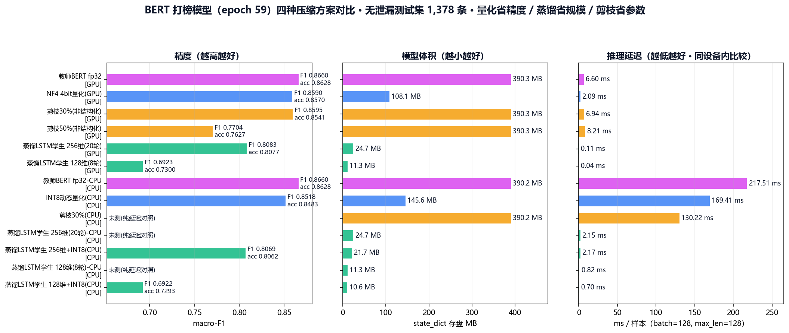

> 图的读法：同一份权重换设备只补测延迟、不重复评测精度（精度与设备无关），因此图中 CPU 行的精度标注为**同权重**的已测值；体积与延迟均为该设备实测。

下表按**方案族**排列（原模型 → 量化 → 剪枝 → 蒸馏），族内按 macro-F1 降序——这样比整表单纯按精度排更能看出同一种手段在不同强度下的取舍。

| 方案 | 设备 | 准确率 | macro-F1 | 体积 | 延迟（ms/样本） | 相对教师（按 macro-F1） |
| --- | --- | ---: | ---: | ---: | ---: | --- |
| **原版 BERT**（教师模型，fp32） | GPU | 0.8628 | 0.8660 | 390.3 MB | 6.50 | 基准 |
| 原版 BERT（教师模型，fp32） | CPU | 0.8628 | 0.8660 | 390.2 MB | 217.51 | 同一模型的 CPU 延迟对照 |
| INT8 动态量化（DQ） | CPU | 0.8483 | 0.8518 | **145.6 MB** | 169.41 | 体积 −62.7%，F1 −1.42 点 |
| NF4 4bit 量化 | GPU | 0.8570 | 0.8590 | **108.1 MB** | **2.09** | 体积 −72.3%，速度 3.1×，F1 −0.70 点 |
| 非结构化剪枝 30% | GPU | 0.8541 | 0.8595 | 390.3 MB | 6.94 | F1 −0.65 点，体积不变 |
| 非结构化剪枝 50% | GPU | 0.7627 | 0.7704 | 390.3 MB | 8.21 | F1 −9.56 点，体积不变 |
| 蒸馏 LSTM 128 维（8 轮） | GPU / CPU | 0.7300 | 0.6923 | **11.3 MB** | 0.04 / 0.82 | 体积 −97.1%，F1 −17.4 点 |
| 蒸馏 LSTM 128 维 + INT8 | CPU | 0.7293 | 0.6922 | 10.6 MB | 0.70 | 学生再量化 |
| 蒸馏 LSTM 256 维（20 轮） | GPU / CPU | 0.8077 | 0.8083 | **24.7 MB** | 0.11 / 2.15 | 体积 −93.7%，F1 −5.77 点 |
| 蒸馏 LSTM 256 维 + INT8 | CPU | 0.8062 | 0.8069 | 21.7 MB | 2.17 | 学生再量化 |

**逐项分析**

- **量化 · 省精度且落地最快**：INT8 动态量化把体积压到 145.6MB（与讲义"390M→145M"同量级），F1 只掉 1.42 个点，但 CPU 延迟仅快 1.28×——动态量化每一步都要"反量化权重→算→再量化"，在本机 CPU 上收益被计算开销吃掉。NF4 4bit 才是三赢：体积 −72.3%、GPU 延迟 3.1×、F1 只掉 0.70 个点，因为 bnb 的 4bit 内核在 GPU 上有专门的去量化算子。**代价是 NF4 只能在 GPU 上跑**（CPU 无对应内核）。
- **剪枝 · 省参数量但最挑硬件**：30% 稀疏度 F1 只掉 0.65 个点，但**体积一点没变而延迟不降反升**（6.94 vs 6.50 ms）——`prune.global_unstructured` 只是逻辑剪枝（把权重置零），稠密 kernel 照样做全量乘加；50% 时 F1 崩到 0.7704，说明该模型的可剪冗余在 30%～50% 之间已经触底。要兑现剪枝收益必须换稀疏推理后端（Torch-TensorRT / cuSPARSE）或改用结构化剪枝，与讲义"剪枝潜力最大但最挑硬件"的判断一致。
- **蒸馏 · 省规模且效果最稳**（前提是训练充分）：学生按讲义口径搭（Embedding + BiLSTM + Linear，`loss =(1−α)·硬标签 CE + α·T²·KL`，T=2、α=0.7）。128 维学生训 8 轮全量（23,852 条）只有 0.7300；扩到 256 维、20 轮后到 **0.8083**（F1），体积 24.7MB（讲义同量级 25.3M）。**另有一次值得记录的反面实验**：若沿用 BERT 的"每轮只抽 1,024 条 × 12 轮"协议训学生，准确率只有 **0.5131**——抽样协议对大模型是防止过拟合的正则，对从零开始的小模型却是纯粹的训练不足。
- **组合拳**：蒸馏学生再叠 INT8 后 21.7MB、CPU 2.17ms/样本；纯学生 CPU 2.15ms。相对教师 CPU 的 217.51ms，是约 **100 倍**的差距——这才是"能上手机/边缘设备"的量级。
- **与打榜联动**：把 5 个压缩变体并入 5.5 榜单后重算，帕累托前沿由 4 个成员变为 **5 个**（ComplementNB、SGD、BERT-NF4、BERT 剪枝 30%、BERT 微调），**LinearSVC 被挤出边界**（BERT-NF4 用约 2.9 秒拿到 0.8590，两轴同时优于它的 7.3 秒 / 0.8221）。需注意 NF4 的耗时来自 GPU，跨设备比较要打折扣（口径见 5.6）。
- **选型建议**（对应讲义"量化落地最快、蒸馏效果最稳、剪枝潜力最大但最挑硬件"）：① 有 GPU、想立刻上线 → **NF4 4bit**；② 只有 CPU 且必须用 BERT → **INT8 动态量化**（146MB，代价 1.45 个点）；③ 要极致小体积 → **LSTM 蒸馏学生**（25MB 以内，代价 5.5 个点，继续加轮次 / 加中间层蒸馏仍有空间）；④ **剪枝暂不推荐**，等稀疏推理后端成熟。
- **与讲义数字的对照**：我们的体积档位与讲义几乎一致（量化 145.6MB ≈ 145M、蒸馏 24.7MB ≈ 25.3M）；精度损失比讲义大（讲义 −1 个点以内，我们量化 −0.7～1.5 点、蒸馏 −5.5 点），主因是本项目训练集只有 2.4 万条（讲义为 18 万条），学生模型的可学信号更少。

> 复现：四个内核的原始输出归并为 `resources/bert_compress.json`（脚本 `resources/merge_compress_results.py`），绘图脚本 `resources/make_compress_fig.py`。

### 5.13 结论

- **BERT 微调是全榜第一**（抽样协议）：前 100 轮最优（epoch 59）macro-F1 0.8660、准确率 0.8628，比最优传统模型 LinearSVC 高约 4.4 个点；代价是 GPU 与约 1,292 秒训练。此前"差距有限"的判断来自**冻结特征 + SVM** 的误用，真正微调后 BERT 明显领先（详见 5.8）。
- **专家组集成未反超单模型最优**：6 位非树传统模型硬投票 0.8048 / 软投票 0.7843，均低于 LinearSVC（0.8221）；oracle 上限 0.9028 说明互补空间存在，但朴素投票未兑现（详见 5.7）。
- **真实泛化水平约 0.82**（传统方法）**到 0.87**（BERT 微调）；此前随机划分下的 0.99 为泄漏虚高，对外一律以上表为准。
- **部署推荐分两种场景**：纯 CPU、零框架依赖的场景仍是 **TF-IDF + 线性 SVM**（训练秒级、推理毫秒级、模型几 MB）；要有 BERT 级精度又能接受 GPU，则选 **BERT-NF4 4bit 量化**（108MB / 2.09ms / 0.8590），机器只有 CPU 又想保留 BERT 语义能力时用 **INT8 动态量化**（145.6MB）或 **LSTM 蒸馏学生**（24.7MB、CPU 2.15ms）。
- **大模型 API 无需训练即可用**：Jev 直接对文本做结构化判定（无训练集依赖、开箱即用），但在本任务上精度不占优（0.7327）；若换用更强的对话模型或补充 few-shot 示例，精度或有提升空间，可作为"零训练冷启动"的备选方案。
- **BERT 微调精度最高但代价高昂**：抽样协议下拿到 0.8660（全场第一），比 TF-IDF + SVM 高约 4.4 个点，却需 GPU 与约 1,292 秒训练，仅当精度优先、且机器需理解未见语义改写时才值得上；追求性价比仍选线性 SVM。
- **任何随机划分的评估都会被系统性高估**，后续所有报告指标都必须采用**按源 id 分组**的划分。
- **帕累托视角下前沿共 5 个成员**：ComplementNB、SGD（hinge）、BERT-NF4 4bit 量化、BERT 剪枝 30%、BERT 微调。压缩变体免训练、耗时个位数秒，把 BERT 家族整段拉进了前沿；LinearSVC 因此退出边界。
- **模型压缩让最高精度变得可部署**：NF4 4bit 把 390MB 压到 108MB、GPU 推理快 3.1 倍，F1 只掉 0.70 个点；INT8 动态量化 145.6MB（CPU 路线）；LSTM 蒸馏学生 24.7MB、CPU 2.15ms/样本（约教师的 1/100），F1 0.8083。剪枝在无稀疏内核时体积与速度都不改善（30% 稀疏只掉 0.65 点但零收益，50% 崩到 0.7704），暂不推荐（详见 5.12）。
- **混淆矩阵暴露出真正的瓶颈类别是电商平台**：四个代表模型的错误都集中在电商平台、影音娱乐、服饰鞋包、数码3C 这一语义互渗的簇上。LinearSVC 只能认出电商平台的 50.0%（56/112），BERT 把这一类提到 77.7%（87/112）——BERT 相对 LinearSVC 净少错的 55 条里有 31 条来自这一个类别；反过来影音娱乐是 BERT 唯一明显失手的类别（54.6%，低于 LinearSVC 的 58.8%）（详见 5.9）。
- **瓶颈的根源在标签定义边界而非模型**：五判据诊断显示电商平台 / 影音娱乐 / 家居日用 / 服饰鞋包 / 数码3C 构成语义互渗簇（类中心相似对榜首 0.849），而同文跨类与前缀重复均为 0 条——区分判据（主诉对象）是标注规范里的隐含规则。影音娱乐的难度此前被低估（无模型自洽率仅 35.1%）；共享出行重叠温和（集体错 10.3%），属定义待细化而非标签缺陷（详见 5.10）。
- **样本量不是瓶颈**：逐类看，类别样本数与四模型平均召回的相关不显著（Pearson r = −0.040，p = 0.879）；电商平台与金融支付样本数完全相同（各 1,816 条），召回却差 39.7 个点。换成不含任何模型的无监督指标就解释得通——最近类中心自洽率 r = +0.857、kNN 同类率 r = +0.748。补数据有用，但修复标签边界更划算（详见 5.11）。

---

## 六、大模型 API 调用与提示词设计

项目里 11 个大模型 API 方法分三类调用方式，提示词也按"要不要一次判多条"设计成三套。以下为实际使用的提示词与解析规则（源码见 `resources/compare_openrouter.py`、`compare_llm_batch.py`、`compare_jev.py`）。

**类别清单**（18 类，三套提示词共用同一份顺序）

> 共享出行 / 医疗健康 / 婚恋交友 / 家居日用 / 影音娱乐 / 房产家装 / 教育 / 数码3C / 旅游出行 / 服饰鞋包 / 本地生活 / 母婴食品 / 汽车 / 游戏 / 物流快递 / 电商平台 / 通讯运营商 / 金融支付

### 6.1 单条判定（OpenRouter 免费池等）

系统提示词要求"只输出类名本身"，用户提示词按"候选类别 + 投诉文本 + 指令"三段式拼装：

```python
SYS = ("你是中文消费投诉文本分类助手。用户给出一条投诉文本和一个候选类别列表，"
       "你必须从中选出唯一最合适的一个类别，只输出该类别的名称本身，"
       "不要输出任何标点、解释或多余文字。")

USER_TPL = ("候选类别（只能选一个）：\n{cats}\n\n"
            "投诉文本：\n{text}\n\n"
            "请只输出最合适的一个类别名。")
```

要点：`temperature=0` 保证可复现；`max_tokens=512` 足够放下一个类名；输出侧不信任模型——解析时先精确命中类名，再退化为子串命中，都不中才算错。

### 6.2 批量打包（商汤 SenseNova / 云知声 / OpenRouter batch）

把 64～128 条文本塞进一次请求，要求模型返回"序号 → 类名"的 JSON，把请求数从 1,378 次压到 11～22 次：

```python
BATCH_SYS = "你是中文消费投诉文本分类助手，需要为一批文本逐条选出唯一最合适的类别。"

BATCH_USER_TPL = ("候选类别（每条只能选一个，必须严格照抄类别名）：\n{cats}\n\n"
                  "请为下面每条投诉文本分类，只输出一个 JSON 对象，键为文本序号（从 1 开始），"
                  "值为类别名，不要输出任何解释或多余文字：\n{items}\n\n"
                  '只输出 JSON，例如：{{"1": "电商平台", "2": "物流快递"}}')
```

四条约定的原因：

- **键从 1 开始且值必须严格照抄类名**：降低模型自创类名（如"电子数码"）的概率，也让解析能直接按类名精确匹配，不必做模糊归类；
- **给一个 JSON 例子**：比只说"输出 JSON"稳得多，尤其是小模型；
- **解析先剥代码块**：模型常把 JSON 包在 ```json 围栏里，解析前先用正则剥掉围栏再 `json.loads`；解析失败的条目单独记 `fail` 计数（5.5 表里的 `4fail` / `5fail` 就是这些）；
- **关闭思考链**：免费池与国内平台里不少是思考模型，不关会把 token 全烧在 reasoning 上、`content` 返回空。对应参数是 OpenRouter `reasoning.enabled=false`、商汤 `reasoning_effort=none`、云知声 `thinking=disabled`。

### 6.3 结构化 Choice（TypeSafe Jev）

Jev 不用自然语言提示词，而是把分类写成 JSON Schema 里的 `choice` 原语，由模型直接返回选项与置信度，省掉"模型自由发挥文本 → 再解析"的不确定性：

```python
"category": {
    "type": "choice",
    "instructions": "这条消费者投诉属于下面哪一个消费领域",
    "criteria": CRITERIA,          # 18 个中文类名，作为枚举候选
}
```

返回 `choice`（选中的类名）+ `confidence`，无需文本解析；代价是精度依赖模型本身（本任务 0.7327）。

### 6.4 三套提示词的效果对照

| 调用方式 | 代表方法 | 全量耗时 | macro-F1 | 结论 |
| --- | --- | ---: | ---: | --- |
| 单条判定 | Jev（Choice 原语） | 85.7s | 0.7327 | 结构化输出无需解析，精度仍是 LLM 里最高的一档 |
| 批量 128 | nex-n2.5-pro（OpenRouter 免费） | 74.8s | 0.7272 | 单请求判 1,378 条，免费额度下最实用的形态 |
| 批量 64 | glm-5.2（商汤） | 246.5s | 0.7242 | 稳定返回 JSON，速度受平台侧影响 |
| 批量 64 | u2-flash（云知声） | 31.2s | 0.7025 | 30 秒跑完全量，最快的一档 |
| 批量 128 | ling-3.0-flash-fin（OpenRouter 免费） | 13.6s | 0.6477 | 全部 API 方法里最快，但精度也是最低的一档 |

结论：**提示词能把自由文本输出变得可解析可复现**，但补不齐封闭词表加细粒度这个任务短板——11 个 API 方法整体落在 0.65～0.73，比 TF-IDF + 线性 SVM 低 9～17 个点。提示词工程在这里的收益是"让 LLM 的输出稳定可用"，而不是"让 LLM 更准"。

## 七、模型部署

三种部署方式都跑同一份模型注册表（`deploy/model_registry.py`），页面统一支持**三个帕累托最优模型任选**、输出 **Top5 类别 + 概率**并显示**响应时间**：

| 方式 | 文件 | 适用场景 | 启动 |
| --- | --- | --- | --- |
| Flask | `deploy/app_flask.py` | 交付演示主页面（改造自 `投满分.ipynb` 的 Flask 单元） | `cd deploy && python app_flask.py 8800` |
| Streamlit | `deploy/app_streamlit.py` | 十分钟内先跑起来的交互页 | `cd deploy && streamlit run app_streamlit.py` |
| FastAPI | `deploy/app_fastapi.py` | 服务化 / 给别的系统调用（自带 `/docs` 接口文档） | `cd deploy && python app_fastapi.py 8801` |

### 7.1 页面能力

- **模型可切换**：ComplementNB / SGD（hinge）/ BERT-NF4 4bit 三个前沿模型；每张模型卡上标注设备（CPU/GPU）、macro-F1 与体积。**环境不支持的模型置灰并写出原因**（如"本机无 CUDA"），绝不静默替换成别的模型。
- **Top5 概率**：横向概率条 + 百分比，第一位加粗。
- **响应时间**：服务端推理耗时与浏览器往返耗时分别显示（讲义要求的"记录响应时间"）。
- **清空按钮**、字数计数（≤500 字）、Ctrl+Enter 快捷预测、示例标签一键填入。
- **分享式演示链接**：`/?model=sgd_hinge&demo=文本&auto=1` 打开即预填并自动预测（截图就是这么取到的）。

### 7.2 展示效果

页面默认态（四个模型卡，其中 GPU 版在本机置灰）：


SGD（hinge）预测结果（Top5 + 概率 + 响应时间）：


BERT-INT8 动态量化在纯 CPU 上的预测结果：


读图要点：**概率不是校准过的置信度**。ComplementNB 的 Top1 常在 10%～20%（朴素贝叶斯的概率输出偏平），SGD（hinge）本身没有 `predict_proba`，页面用的是 OvR `decision_function` 经 softmax 的近似值——排序可用，绝对值别当真。BERT 系列是正常 softmax，概率分布更陡。

### 7.3 模型下载

| 文件 | 大小 | 设备要求 | 下载 |
| --- | ---: | --- | --- |
| `bert_nf4_state.pt`（NF4 4bit 量化，F1 0.8590） | 108.2 MB | GPU + bitsandbytes | [下载](https://github.com/Barry-Wuu/text_classfication/releases/download/deploy-models/bert_nf4_state.pt) |
| `bert_int8_state.pt`（INT8 动态量化，F1 0.8518） | 145.6 MB | 纯 CPU | [下载](https://github.com/Barry-Wuu/text_classfication/releases/download/deploy-models/bert_int8_state.pt) |
| `deploy_models_meta.json`（加载说明与指标） | 2 KB | — | [下载](https://github.com/Barry-Wuu/text_classfication/releases/download/deploy-models/deploy_models_meta.json) |
| 原版 BERT 微调权重 `bert_epoch59.pt`（F1 0.8660，教师模型） | 390.3 MB | GPU | [下载](https://github.com/Barry-Wuu/text_classfication/releases/download/bert-weights/bert_epoch59.pt) |
| 两个非 BERT 模型（ComplementNB / SGD(hinge)） | 5.2 MB | 纯 CPU | 随仓库提供：`deploy/models/` |

全部权重统一托管在**本仓库**（`Barry-Wuu/text_classfication`）的 Release 里，共两个：

| Release | 内容 |
| --- | --- |
| [`bert-weights`](https://github.com/Barry-Wuu/text_classfication/releases/tag/bert-weights) | BERT 微调权重：打榜模型 `bert_epoch59.pt` + 3 个训练检查点（`bert_epoch10/26/60.pt`）+ 选模证据 `bert_best100.json` + 训练日志 `result*.json`，合计 1.52 GB |
| [`deploy-models`](https://github.com/Barry-Wuu/text_classfication/releases/tag/deploy-models) | 部署用量化权重：`bert_nf4_state.pt`、`bert_int8_state.pt` 与 `deploy_models_meta.json` |

> 原先 BERT 权重挂在组长仓库的 Release 上，现已整体迁移到本仓库；README 与各脚本里的下载链接（含 Kaggle 脚本取数据用的 raw 链接）同步更新，仓库内不再引用外部仓库。

**下载后的放置方式**

```
deploy/models/                     # 量化权重放这里，注册表会自动识别
├── bert_nf4_state.pt              # 需自行下载（108.2 MB）
├── bert_int8_state.pt             # 需自行下载（145.6 MB）
├── tfidf_vectorizer.joblib        # 仓库自带
├── complementnb.joblib            # 仓库自带
├── sgd_hinge.joblib               # 仓库自带
├── labels.json                    # 仓库自带（18 类顺序）
└── metrics.json                   # 仓库自带（两个非 BERT 模型的回测指标）
```

量化权重也可放别处，用环境变量指定：`set DEPLOY_MODEL_DIR=D:\models\deploy`。BERT 基座默认取 `D:\models\bert-base-chinese`，可用 `BASE_BERT` 覆盖。

### 7.4 部署注意事项

- **NF4 只能 GPU 而 INT8 只能 CPU**：这是 PyTorch / bitsandbytes 的硬限制，不是实现取舍；注册表据此做可用性探测，页面把不可用模型置灰。
- **首次调用偏慢**：jieba 首次加载词典约 0.8s、BERT 首次加载权重数秒；之后 ComplementNB / SGD 在毫秒级（见截图的"服务端 4.24 ms"）。
- **两个非 BERT 模型随仓库分发**，量化权重走 Release——仓库单文件上限 100MB，388MB 级的权重必须走 Release 附件。
- **模型不可用时页面报错而不是降级**：宁可让用户看到"该模型不可用"，也不要用别的模型冒充结果。

## 八、仓库结构

```
text_classfication/
├── README.md                项目说明
├── train_augmented.csv      训练数据（30,000 条，18 类，含规则增强字段）
├── clean.csv                字符级清洗后的数据（text, category 两列）
├── labeled.csv              清洗 + 整数标签（text, category, label 三列）
├── deploy/                  模型部署（Flask / Streamlit / FastAPI）
│   ├── model_registry.py    模型注册表：统一 Top5 预测接口与可用性探测
│   ├── page_html.py         页面模板（改造自 投满分.ipynb 的 Flask 内嵌页）
│   ├── app_flask.py         Flask 版（主页面）
│   ├── app_streamlit.py     Streamlit 版
│   ├── app_fastapi.py       FastAPI 版（含 /docs）
│   ├── jieba_cut.py         模块级分词函数（供 joblib 序列化引用）
│   ├── train_export_models.py 训练并导出两个非 BERT 模型
│   └── models/              部署用模型（joblib 小模型 + 量化权重放置位）
├── eda/                     探索性数据分析
│   ├── eda.py               分析脚本（matplotlib + jieba + wordcloud）
│   ├── EDA.md               分析报告与结论
│   ├── eda_summary.txt      关键统计量汇总
│   ├── ab_test.py           省流 A/B 增益对比
│   ├── ab_speed.py          省流 A/B 速度对比
│   ├── dim_reduction.py     降维可视化脚本（TF-IDF → SVD → t-SNE，三面板）
│   ├── dim_reduction.json   降维口径、kNN 同类率与各类簇中心坐标
│   └── figures/             分析图表（含词云与降维可视化）
├── kaggle/                  Kaggle 内核源码（GPU 实验与云上传）
│   ├── README.md            内核清单、复现顺序与 GH_TOKEN 配置
│   ├── cmp_int8/            INT8 动态量化内核（CPU）
│   ├── cmp_nf4/             NF4 4bit 量化内核（GPU + bitsandbytes）
│   ├── cmp_prune/           非结构化剪枝内核（30% 与 50%）
│   ├── cmp_kd/             软标签蒸馏 v1（沿用抽样协议的反面实验）
│   ├── cmp_kd2/            软标签蒸馏 v2（LSTM 128 维 8 轮）
│   ├── cmp_kd3/            软标签蒸馏 v3（LSTM 256 维 20 轮，最终采用）
│   ├── bert_cm/             BERT 混淆矩阵内核（产出 bert_confusion.json）
│   ├── bert_joint/          LinearSVC 与 BERT 逐样本联合分布内核（产出 bert_svc_joint.json）
│   ├── export_models/       量化权重直传 Release deploy-models
│   ├── migrate_release/     Release 附件跨仓库搬运内核
│   ├── github_bert_push/    BERT 打榜权重直传 Release bert-weights
│   ├── gen_kernels.py       压缩内核的批量生成器（改配置即重出全部内核）
│   └── deprecated/          弃用版本（BERT 训 BERT、LSTM v2 报错版）
└── resources/               预处理与建模资产
    ├── preprocess.py        字符级清洗脚本
    ├── normalize_ids.py     强标识符省流脚本
    ├── build_labels.py      标签表与整数标签生成脚本
    ├── to_tensor_bert.py    BERT tokenizer 张量化脚本
    ├── to_tensor_tfidf.py   词频自训词表 + TF-IDF 张量化脚本
    ├── compare_tensors.py   三条张量策略效果对比脚本
    ├── compare_no_leak.py   无泄漏（分组划分）三策略对比脚本
    ├── compare_tfidf_clf.py TF-IDF + 多分类器横向对比脚本
    ├── compare_tfidf_gbdt.py TF-IDF + 梯度提升树（XGBoost/LightGBM）对比脚本
    ├── compare_fasttext.py  fastText 监督分类对比脚本
    ├── compare_jev.py       大模型 API（TypeSafe Jev）分类对比脚本
    ├── compare_openrouter.py OpenRouter 免费大模型分类对比脚本
    ├── compare_llm_batch.py 国内大模型 API 批量分类对比脚本（商汤 SenseNova / 云知声 U2-FLASH）
    ├── compare_ensemble.py  传统老机器学习"专家组"集成（硬投票/软投票）对比脚本
    ├── compare_bert_finetune.py BERT 抽样微调脚本（每轮随机抽 1024 条，Kaggle GPU）
    ├── continue_bert/       BERT 续训内核（阶段 2：epoch 11~30）
    ├── continue_bert2/      BERT 续训内核（阶段 3：epoch 31~60）
    ├── continue_bert3/      BERT 续训内核（阶段 4：epoch 61~105）
    ├── make_compare_fig.py  模型对比图生成脚本
    ├── make_pareto_fig.py   耗时—准确率帕累托图生成脚本
    ├── make_bert_curve.py   BERT 损失 / 准确率经典曲线生成脚本
    ├── confusion_matrices.py 三个传统前沿模型的 18 阶混淆矩阵复算脚本
    ├── make_confusion_fig.py 混淆矩阵热力图生成脚本（蓝白配色 + 黑白字自适应）
    ├── make_compress_fig.py  模型压缩四方案对比图生成脚本
    ├── merge_compress_results.py 各压缩内核输出归并为 bert_compress.json
    ├── label_overlap_diag.py 标签质量五判据诊断脚本（集体错率 / 类中心相似度 / 自洽率 / 漂移 / 噪声排查）
    ├── bert_svc_joint.py    LinearSVC 与 BERT 逐样本联合分布复算脚本（本地版，权重需先取回）
    ├── make_venn_fig.py     5.10 节两张韦恩图生成脚本（互渗簇定性图 + 模型互补定量图）
    ├── make_size_accuracy_fig.py 5.11 节逐类准确率归因图（样本量 vs 标签质量指标）
    ├── leak_check.py        增强泄漏核查脚本
    ├── tfidf_clf_result.json 30 个方法的榜单结果（5.5 表与 09/10 图的数据源）
    ├── ensemble_diag.json   专家组逐专家指标 + oracle 上限 + 分歧率诊断
    ├── bert_best100.json    BERT 前 100 轮最优模型依据 + epoch 1~105 逐轮曲线
    ├── confusion_matrices.json 三个传统前沿模型的 18x18 计数混淆矩阵
    ├── bert_confusion.json  BERT（epoch 59）在测试集上的 18x18 计数混淆矩阵
    ├── label_quality_diag.json 标签质量诊断原始数据（五判据全类结果）
    ├── size_vs_accuracy.json 逐类样本量 / 召回率 / 无监督指标与相关分析结果
    ├── bert_svc_joint.json  LinearSVC 与 BERT 逐样本联合分布（Kaggle 内核产出）
    ├── bert_compress.json   四种压缩方案的全指标结果（INT8/NF4/剪枝/蒸馏，Kaggle 内核产出）
    ├── class.txt            标签表（一行一类，行号即 label id）
    ├── label_map.csv        标签映射（id, name, count）
    ├── vocab.txt            词表（一行一词，行号即 id）
    ├── figures/             建模对比图（09_model_compare.png、10_pareto.png、11_bert_loss.png、12_bert_acc.png、13~16 四个代表模型的 18 阶混淆矩阵、17~18 标签质量韦恩图、19 模型压缩四方案对比、20 样本量与准确率关系、deploy_0x 部署页面效果）
    ├── PREPROCESS.md        预处理报告
    └── TENSOR.md            标签表、张量策略与建模结论报告
```

## 九、参与方式

项目采用分支协作：成员各自在独立分支开发，通过 Pull Request 合并到 `main`。提交前请确保数据处理与评估脚本可复现，并在描述中说明改动范围与验证结果。
