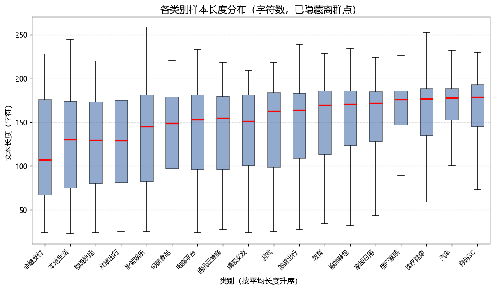
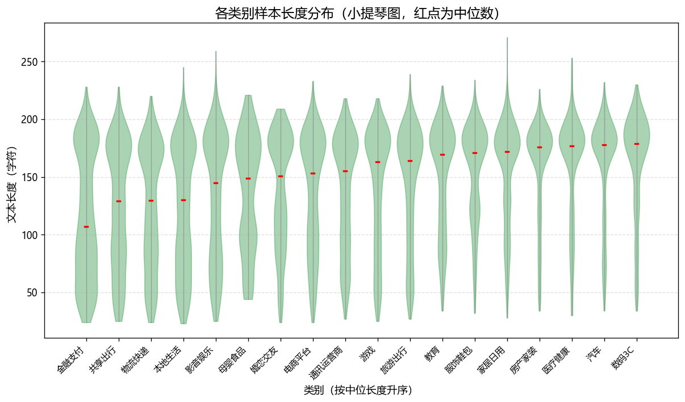
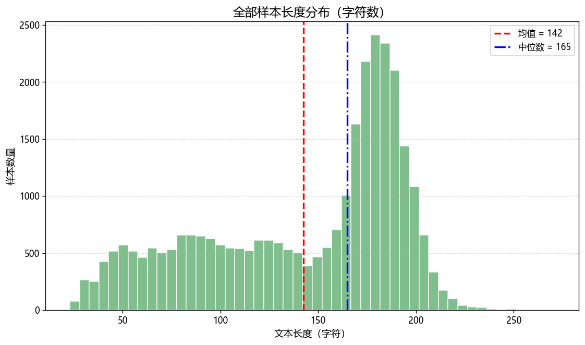
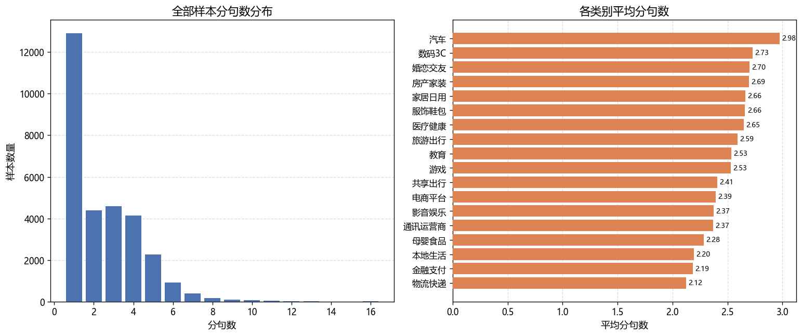
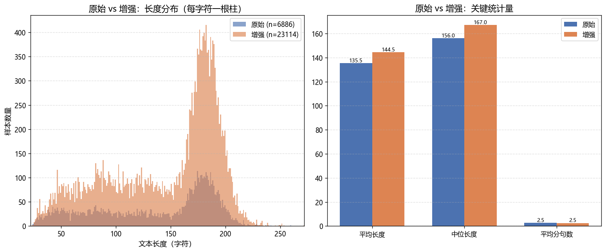
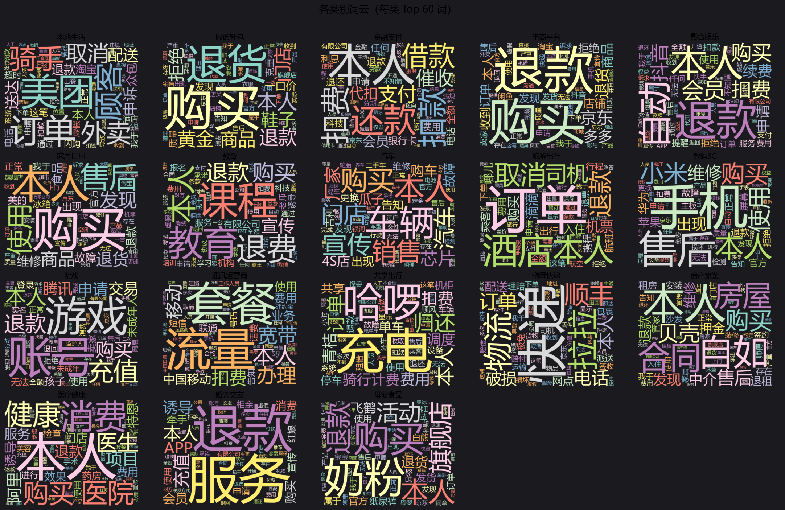

# 探索性数据分析（EDA）

本文对 `train_augmented.csv`（消费者投诉文本分类数据集）做初步的探索性分析，目的是在建模之前先把数据的“长相”摸清楚：各类别样本有多少、句子有多长、一句话里有几句。

分析脚本为同目录下的 `eda.py`，仅依赖 Python 标准库与 matplotlib（古法 plt，未使用 seaborn）。运行方式：

```bash
python eda/eda.py
```

脚本会在 `eda/figures/` 下生成 6 张图表，并把关键统计量写入 `eda/eda_summary.txt`。

---

## 一、数据集概览

在展开各项图表之前，先把整体规模列一下：

| 指标 | 数值 |
| --- | --- |
| 样本总数 | 30,000 |
| 类别数 | 18 |
| 原始样本 | 6,886（22.95%） |
| 增强样本 | 23,114（77.05%） |
| 文本长度（字符） | 最小 23 / 最大 271 / 均值 142.5 / 中位 165 |
| 分句数 | 最小 1 / 最大 16 / 均值 2.51 / 中位 2 |

一个值得注意的点是：文本长度的均值为 142.5、中位数为 165，**均值明显小于中位数**，这说明长度分布左偏——有一批很短的样本把均值拉了下来。这一点会在第三节展开。

---

## 二、各类别样本数量


图 1 用堆叠柱状图呈现 18 个类别的样本量，蓝色为原始样本、橙色为增强样本，柱顶数字为该类总量。

从图中能读出两件事：

- **增强后基本被拉平**：除尾部三个类别外，其余类别总量都落在 1,749~1,848 之间，类别间差距被控制在 100 条以内。这正是数据增强要达到的效果——把原始数据的长尾削平。
- **尾部仍有欠账**：医疗健康（1,382）、婚恋交友（1,297）、母婴食品（416）三类的总量明显低于其余类别。原因在于它们的原始样本实在太少（分别只有 144、133、43 条），即便按最高倍率增强（×9.6~×9.8），也没能补到 1,700 量级。

换句话说，增强让分布“均衡了很多”，但并没有做到完全均衡。建模时这三类仍是需要重点关注的弱势类别。

---

## 三、各类别样本长度分布

同一批文本数据，用两种视角看长度分布：箱线图看分位数，小提琴图看整体密度形状。两张图是同一份数据的互补表达。

### 3.1 箱线图



图 2 按平均长度升序排列各类别，箱体表示四分位区间（Q1~Q3），红点线为中位数，须线为极值（已隐藏离群点）。

关键观察：

- **类别间长度差异不大**：所有类别的中位数都集中在 120~180 之间，没有出现某个类别明显偏长或偏短的情况。
- **金融支付最短**：中位数约 107，箱体整体下移，明显短于其他类别。投诉金融支付的用户往往一两句就把问题说清了（如“某平台乱扣费”），不需要长篇叙述。
- **数码3C / 汽车最长**：中位数都在 178 左右。数码产品的参数、型号描述本就冗长，写起来自然更长。

### 3.2 小提琴图



图 3 用 KDE（核密度估计）画出各类别长度的分布形状，红点为中位数。相比箱线图，小提琴图能看出分布的“胖瘦”和“多峰”——

- **单峰为主**：绝大多数类别的密度集中在中上部（约 150~200 字符），呈现“上胖下瘦”的单峰形态，说明长文本是主体，短文本是少数。
- **少数类别底部有浅峰**：金融支付、共享出行等类别在 60~100 字符处能看到一个小的隆起，对应那批“一句话说清投诉”的短样本，与其箱线图中箱体下移的现象互相印证。

---

## 四、全部样本长度分布



图 4 把全部 30,000 条样本的长度画成直方图，红色虚线为均值（142），蓝色点划线为中位数（165）。这里每个字符长度对应一根柱子（不合并区间），因此可以直接读出某个具体长度上有多少条样本。

这张图清楚解释了开头那个“均值小于中位数”的现象：

- **主峰在 150~200**：绝大多数样本长度落在这个区间，正文主体偏长，且柱高起伏能看到细节。
- **左侧拖尾**：在 40~130 之间有一片不高但铺得很开的“平原”，对应那批短样本。正是这些短样本把均值从 165 拉低到 142。

从建模角度看，这个分布对传统机器学习模型是有利的——长度集中意味着定长截断/填充造成的损失可控。

---

## 五、句子数量分析

除了字符长度，句子数量是另一个反映文本复杂度的维度。分句规则为按中文（及英文）句末标点 `。！？!?；;\n` 切分，统计非空句数。



图 5 由左右两个子图构成。

**左图 全部样本分句数分布** 分布极度集中在低值区：

| 分句数 | 1 | 2 | 3 | 4 | 5 | 6 | 7 | ≥8 |
| --- | ---: | ---: | ---: | ---: | ---: | ---: | ---: | ---: |
| 样本数 | 12,909 | 4,393 | 4,599 | 4,142 | 2,270 | 905 | 393 | 389 |

近六成样本只由 1 句话构成（12,909 / 30,000 ≈ 43%，加上 2 句则接近 58%），5 句以上锐减，长尾一直拖到 16 句。这说明绝大多数投诉文本是“一口气说完一件事”，结构简单。

**右图 各类别平均分句数** 各类别均值都在 2.0~3.0 之间，差异有限：

- **汽车最高**（2.96）：整车投诉往往要交代车型、故障现象、维修经过，天然分句多；
- **物流快递最低**（2.12）：快递问题描述直接（“包裹丢了”“迟迟不派送”），往往一句话解决。

---

## 六、原始与增强样本对比

增强样本占了全量的四分之三，它的分布是否与原始样本一致，直接决定了“增强是否引入了分布偏移”。图 6 做两两对比：



**左图 长度分布叠加** 原始样本（蓝）的分布明显更“扁”、覆盖范围更宽；增强样本（橙）则形成一个高而窄的尖峰，集中在 160~190 之间。同样的，这里每个字符长度对应一根柱子，能看清尖峰内部的细节起伏。这说明规则增强很可能是围绕原始样本中的长文本做了规范化改写，导致增强后的长度更趋同。

**右图 关键统计量对比**

| 统计量 | 原始 | 增强 | 差值 |
| --- | ---: | ---: | ---: |
| 平均长度 | 135.5 | 144.5 | +9.0 |
| 中位长度 | 156.0 | 167.0 | +11.0 |
| 平均分句数 | 2.5 | 2.5 | 0 |

增强样本的长度整体比原始样本略长 9~11 字符，但分句数基本一致。这个偏移量不算大，属于可以接受的范围；但若做严格的消融实验，应当把这一点纳入考虑——**评估指标优先在原始样本上报告**，才能反映真实分布下的模型表现。

---

## 七、词云分析

前面几节看的都是“结构性”指标（数量、长度、句数），这一节转到“内容”层面：投诉文本究竟在说什么。文本分词用 `jieba` 完成，词云用 `wordcloud` 渲染，并做了以下预处理：

- 只保留**长度 ≥ 2** 的词（剔除单字，避免“的”“了”之类的噪声刷屏）；
- 剔除**纯数字**与**纯符号**；
- 用一份**停用词表**过滤无信息量的通用词（如“本人”“问题”“情况”“处理”“投诉”等）——但注意，部分高频通用词仍会残留（见本节末的说明）。

### 7.1 全样本词云


全样本词云取了 Top 200 词。从词频看，整个数据集的**主题词分布高度集中**：

| 排名 | 词 | 词频 |
| ---: | --- | ---: |
| 1 | 购买 | 11,496 |
| 2 | 退款 | 10,684 |
| 3 | 使用 | 6,571 |
| 4 | 订单 | 6,245 |
| 5 | 售后 | 6,083 |
| 6 | 申请 | 5,371 |
| 7 | 拒绝 | 5,007 |
| 8 | 费用 | 4,899 |
| 9 | 发现 | 4,808 |
| 10 | 服务 | 4,668 |

几点观察：

- **投诉的主线是消费交易**：“购买”“订单”“售后”“退款”构成一个完整的交易-售后链路，说明绝大多数投诉都发生在“交易之后、售后环节”。
- **高频动词偏对抗**：“申请”（多为申请退款）、“拒绝”（多为商家拒绝）成对出现且词频都很高（5,371 / 5,007），勾勒出“用户申请—商家拒绝”的典型冲突场景。
- **费用与扣费**相关词频合计很高，说明“钱的问题”是投诉的核心动因之一。

### 7.2 各类别词云



18 个类别各取 Top 60 词，拼成 4×5 网格。整体上看，**类别间的用词区分度相当高**，这对分类任务是好消息——说明标签体系与文本语义是强对应的。逐类看关键区分词：

| 类别 | 最具代表性的词 | 说明 |
| --- | --- | --- |
| 本地生活 | 美团、骑手、外卖、配送、众包 | 外卖平台场景鲜明 |
| 物流快递 | 快递、拉拉、物流、顺丰、极兔、派送 | 快递公司名 + 物流动作 |
| 金融支付 | 还款、扣款、借款、催收、代扣、银行卡 | 借贷与代扣场景 |
| 游戏 | 账号、游戏、充值、交易、未成年人、孩子 | 充值/账号交易，含未成年人退款 |
| 婚恋交友 | 服务、充值、诱导、APP、会员、红娘、相亲 | 交友平台诱导消费 |
| 通讯运营商 | 套餐、流量、宽带、移动、联通、话费 | 运营商资费问题 |
| 房产家装 | 自如、合同、房屋、贝壳、中介、押金、退租 | 租房中介与长租公寓 |
| 教育 | 课程、教育、退费、宣传、机构、报名、老师 | 培训机构退费 |
| 数码3C | 手机、小米、苹果、华为、屏幕、维修 | 手机品牌与硬件故障 |
| 汽车 | 车辆、芯片、销售、4S店、购车、瓜子 | 汽车销售与配置纠纷 |
| 旅游出行 | 酒店、机票、取消、司机、入住、航班 | 出行订单取消 |
| 服饰鞋包 | 黄金、鞋子、一口价、克重、质量、旗舰店 | 黄金克重与服饰退货 |
| 医疗健康 | 消费、健康、医院、医生、诱导、效果 | 医美/诱导消费 |
| 母婴食品 | 奶粉、飞鹤、纸尿裤、发货、白熊 | 母婴商品与发货 |
| 电商平台 | 京东、退货、多多、店铺、卖家、收到 | 综合电商场景 |

一个有意思的规律：**品牌/平台名是类别区分的最强信号**——“美团”“哈啰”“顺丰”“京东”“小米”“自如”“飞鹤”等专有名词一出现，类别基本就锁定了。这提示在特征工程上，**专有名词的保留**（不要过度泛化）对分类精度很关键；若使用 BERT，预训练词表能否覆盖这些品牌词也会影响效果。

### 7.3 关于分词与词云的局限

需要如实说明的是，这份词云并不能做到“干净”，主要有几类噪声：

- **分词错误**：“有限公司”被当作整体切出（3,388 次），本应是一个无意义的机构后缀；“我于”这类跨词边界的组合也被切了出来。
- **品牌词与通用词混杂**：词云里既有“美团”“哈啰”这样真正有区分度的品牌，也有“本人”“购买”“退款”这类全类别通用词——后者即便设了停用词仍会残留，因为它们同样是真实的高频内容词，过度删除反而会丢失信息。
- **未做同义归并**：“扣费”“扣款”“代扣”语义相近却各自成词，“退款”“退费”“退还”同理，词频被稀释。

因此，**词云更适合做定性观察**（快速判断数据在讲什么、类别是否可分）**而不是精确的量化依据**。若后续要做基于词频的特征分析，建议补充：自定义词典（把品牌名、领域词固化）、同义词归一，以及 TF-IDF 加权（抑制全类别通用词的影响）。

---

## 八、降维可视化：18 个类在向量空间里分得开吗

前面几节看的是数量、长度与词频，这一节换一个视角：把每条投诉文本表示成 TF-IDF 向量，再降到二维平面上直接看类别的分布。做法见 `eda/dim_reduction.py`——jieba 分词 + TF-IDF（`min_df=2`，12,944 维）→ TruncatedSVD 降到 100 维 → t-SNE 投到二维。

先交代两个口径：

- **只用原始样本**（6,886 条）。数据集 77% 是规则增强样本，每条增强样本与源样本几乎是同一句话的变体，若混在一起投影，同一源样本的多个变体会叠成一个点，掩盖真实的类间结构。
- **t-SNE 保留的是局部邻域关系**：簇分开不代表类别可分，簇咬合也不等于不可分。它只回答"在这套词面特征下，各类的点是否彼此穿插"。


三个面板各有分工：A 是线性投影（SVD 前两个主成分），B 是 t-SNE 全 18 类并标出分得开的簇，C 沿用 B 的坐标、只保留 5 个互相渗透的类。

**结论一 · 线性投影看不出类别**。前两个主成分只承载 3.4% 的方差，散点被拉成一条从左下到右上的斜带；A 面板左上那个孤立团有 588 条（8.5%），中位长度 186 字符、明显长于全体的 156 字符，而类别构成却很分散（物流快递、本地生活、电商平台……各不相同）。也就是说，**线性投影的前几个主成分抓到的是文本长度这类与类别无关的方差**。想在二维平面上看类别结构，必须用非线性方法。

**结论二 · t-SNE 下只有 5 个类真正独立**。以"类中心到最近邻类中心的距离 ≥ 12"为判据，只有教育、旅游出行、游戏、通讯运营商、金融支付这 5 个类与邻居拉开了距离，它们的共同点是话题边界清楚、专有词汇集中。

**结论三 · 其余 13 个类挤在中央互相咬合**，包括家居日用、服饰鞋包、数码3C、房产家装、医疗健康、婚恋交友、母婴食品、汽车、影音娱乐、共享出行、本地生活、物流快递、电商平台。这 13 个类**每一个到它最近邻类中心的距离都小于 12**，在图上表现为中央一大团彼此穿插的点——**簇的边界在这里基本失效**。

**结论四 · 无监督邻域指标与后文的模型误判同向**。在 SVD 空间里取每条样本的 10 个最近邻，统计邻居是否与自己同类：整体同类率 46.6%，而几个老大难明显更低——母婴食品 3.3%（仅 43 条原始样本，极不稳）、影音娱乐 23.9%、电商平台 25.6%、医疗健康 26.2%、婚恋交友 30.5%、家居日用 32.1%。这份名单与 5.10 节用四模型集体错率、类中心自洽率得到的难类榜单方向一致，说明**难度是数据本身的性质而非某个模型没调好**。

本节只给可视化层面的观察；重叠到底有多重、是否源于标注定义，由 5.10 节的五条判据量化。

---

## 九、小结

把上面几节的发现汇总成几条对建模有直接意义的结论：

1. **类别已基本均衡但尾部三类仍偏少**：医疗健康、婚恋交友、母婴食品样本量明显低于其他类别，训练时建议对这三类做额外加权或采样处理。
2. **文本长度集中且左偏**：主峰在 150~200 字符，平均 142 字符，适合设定固定的 `max_length`；短尾样本的存在提示不宜把截断长度设得过长。
3. **文本结构简单**：近六成样本仅 1~2 句，说明投诉文本多为单句直述，模型无需过深的层级结构即可捕捉语义。
4. **增强引入轻微分布偏移**：增强样本比原始样本长 9~11 字符，做消融实验时需留意，评估应优先基于原始样本。
5. **内容主线是交易与售后**：全样本高频词集中在“购买/订单/售后/退款/拒绝/费用”，反映投诉多发生在交易之后的售后环节。
6. **类别用词区分度高**：各类别词云差异明显，品牌/平台名（美团、哈啰、顺丰、京东等）是最强的类别信号，提示专有名词的保留对分类精度很重要。
7. **类别可分性两极分化**：降维可视化显示，只有教育、旅游出行、游戏、通讯运营商、金融支付这 5 个类在平面上独立成簇，其余 13 个类（含电商平台、服饰鞋包、家居日用、影音娱乐等）在中央互相咬合；无监督 kNN 同类率仅 46.6%，其中母婴食品、影音娱乐、电商平台最低。瓶颈很可能出在标签定义边界上，5.10 节对此做了专项诊断。

---

## 附：文件清单

| 文件 | 说明 |
| --- | --- |
| `eda/eda.py` | EDA 分析脚本（纯 matplotlib + jieba + wordcloud） |
| `eda/dim_reduction.py` | 降维可视化脚本（TF-IDF → SVD → t-SNE，三面板） |
| `eda/dim_reduction.json` | 降维口径、kNN 同类率与各类簇中心坐标 |
| `eda/EDA.md` | 本文档 |
| `eda/eda_summary.txt` | 关键统计量文本汇总 |
| `eda/figures/01_category_counts.png` | 各类别样本数量分布 |
| `eda/figures/02_category_length_box.png` | 各类别长度箱线图 |
| `eda/figures/03_category_length_violin.png` | 各类别长度小提琴图 |
| `eda/figures/04_all_length_hist.png` | 全部样本长度直方图 |
| `eda/figures/05_sentence_counts.png` | 分句数分布 |
| `eda/figures/06_orig_vs_aug.png` | 原始 vs 增强对比 |
| `eda/figures/07_wordcloud_all.png` | 全部样本词云 |
| `eda/figures/08_wordcloud_by_category.png` | 各类别词云 |
| `eda/figures/09_dim_reduction.png` | 降维可视化（线性投影 / t-SNE 全类 / 互渗簇高亮） |
